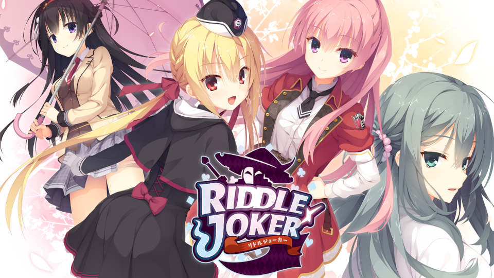
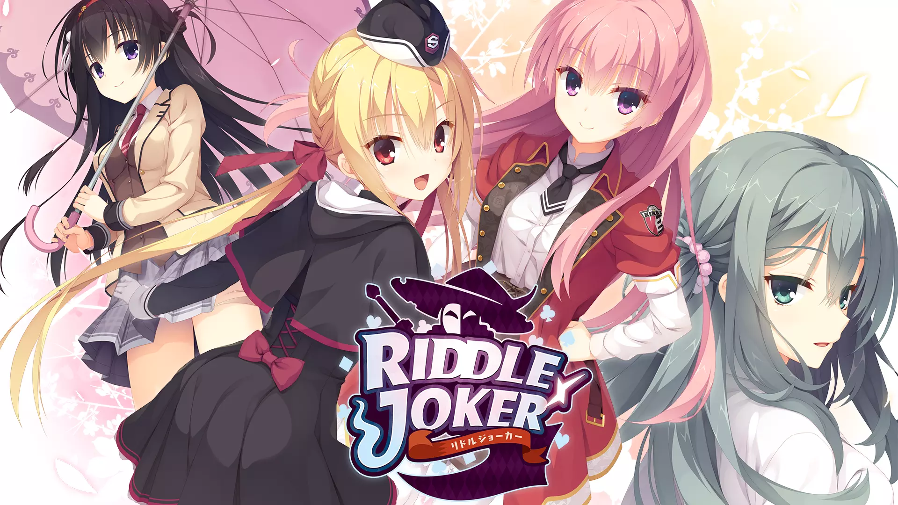
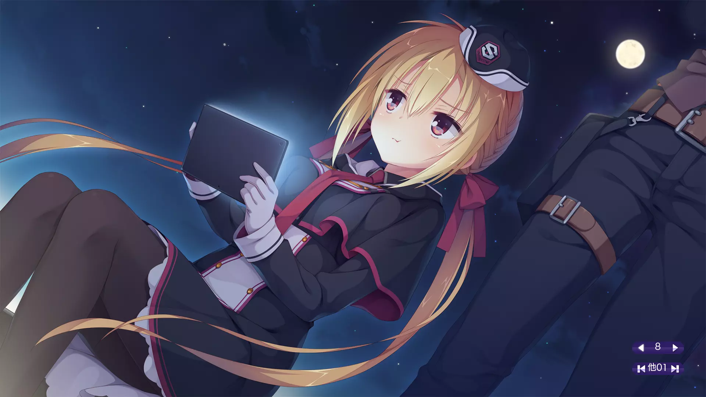
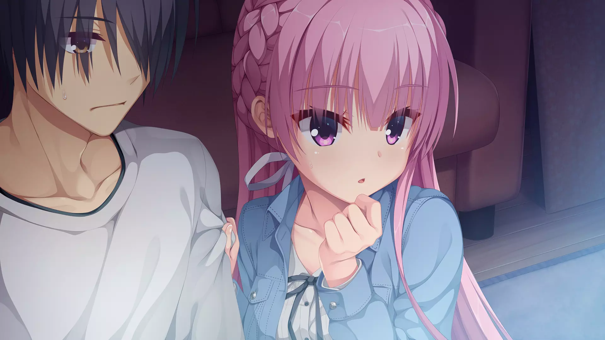
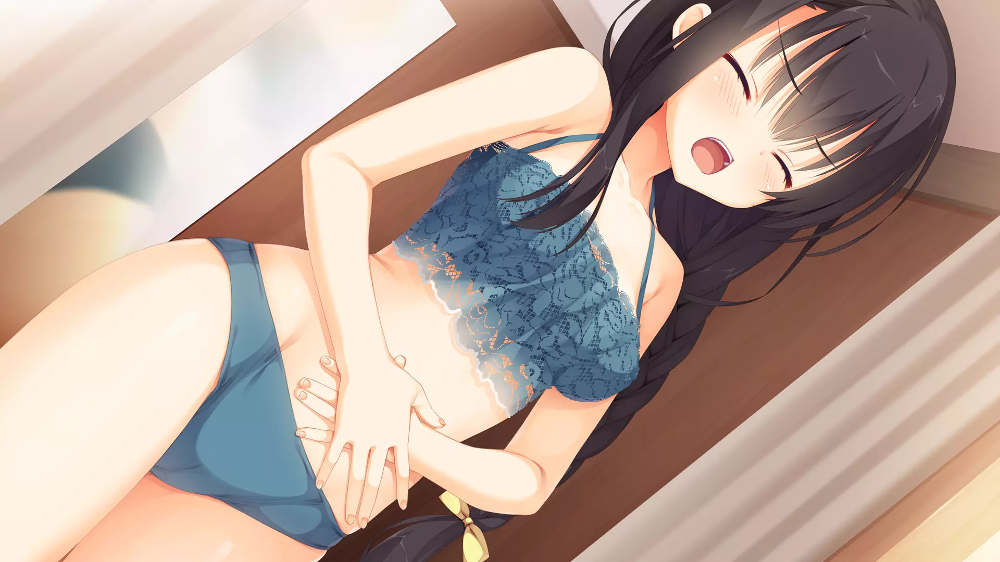
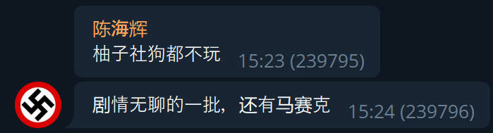
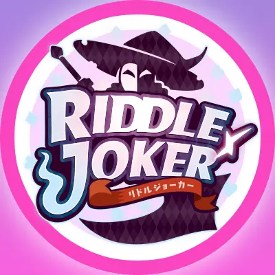

`作者：桐遠暮羽`



## At A Glance

王牌特務男主角和妹妹搭檔 潛入超能力學院，調查學院不可告人的迫真驚天祕密。

<p id="coverimage-warp">
  
</p>


| 資訊一覽     |                 |
| :----------- | :------------------------------------ |
| **又名**     | 密命王牌           |
| **開發商**   | 柚子社           |
| **遊戲時長** | 35h                     |
| **攻略人數** | 5                     |
| **類型**     | 科幻 搞笑          |
| **難度**     | 中（選項挺多但是有路線圖）    |
| **分級**     | R-18（性行爲）      |
| **遊戲引擎** | KIRIKIRI Z      |


## 故事

20 世紀末期，人類發現了一種稱爲**「Astral 粒子」**的物質，<br class="d-none d-md-inline">當這種粒子和你的大腦產生奇妙深刻的反應之後，你的大腦便會升級，
然後你就會獲得能夠憑空控制 力、風、水、火 等各種物理現象的超能力，
這被稱爲「Astral 能力」。

在這種世界背景下的男主角 ***在原暁***，是一個高中生特務。（什麼奇妙玩意）
他和妹妹 ***七海*** 都隸屬於機密政府組織**「情報局特別班」**，<br class="d-none d-md-inline">每天的工作就是暗中解決 超能力者引發的各種犯罪問題。
（就有點類似於 ***Watch_Dogs*** 裏面的私法制裁者）

<p>
  
</p>

沈迷於特務工作的男主角已經多次考試掛科，面臨留級的危險，
已經忍無可忍的頂頭上司，也就是他們的老爹，決定讓他們倆轉學，<br class="d-none d-md-inline">進入專爲研究 Astral 能力而開設的學校，***橘花學院***，
同時執行潛伏任務，在特班需要時 從 Astral 研究系統中竊取情報。

然後他們就逐漸接近了學校不可告人的驚天祕密，，，


## 登場人物

<style>
  .charname {
    font-size: 150%;
  }
  .namearea hr {
    margin: 1.5rem 0;
  }
  .sp-character img, .img-shade {
    filter: drop-shadow(0 0 6px #000c);
  }
  .sp-character {
    border-radius: 20px;
    overflow: hidden;
    box-shadow: 0 5px 11px 0 rgb(0 0 0 / 18%), 0 4px 15px 0 rgb(0 0 0 / 15%);

    /*-webkit-backdrop-filter: blur(1px);
    backdrop-filter: blur(1px);
    
    background-color: var(--chara-card-color);*/
    
    background-color: transparent;
    background-image: var(--this-bg);
    background-position: center;
    background-repeat: no-repeat;
    background-size: cover;

  }
  .sp-character .char-overlay {
    background-color: var(--chara-card-color);
    min-height: 450px;
    background-image: var(--right-bg);
    background-repeat: no-repeat;
    background-position: top 0px right calc(100% * 0.3 - 130px);
    background-size: 300px;

    margin: 0;
    padding: 0;
  }
  :root { /* 配色 */
    --chara-card-color: #ffffffcf;
  }
  [data-user-color-scheme='dark'] {
    --chara-card-color: #1a1a1aa6;
  }
  @media screen and (max-width: 767px) {
    .namearea hr {
      margin: 1rem 0;
    }
    .pc-left {
      -webkit-backdrop-filter: blur(3px);
      backdrop-filter: blur(3px);
      
      background: var(--chara-card-color);
      transition: opacity 0.3s;
    }
    .pc-left.touch {
      opacity: 0.1;
    }
    .sp-character {
     /*background: unset;*/
      /*-webkit-backdrop-filter: unset;
    backdrop-filter: unset;*/
    }
    .sp-character .char-overlay {
      min-height: unset;
      background-size: contain;
      background-position: bottom 0px right 0px;
    }
    :root { /* 配色 */
      --chara-card-color: #ffffff87;
    }
    [data-user-color-scheme='dark'] {
      --chara-card-color: #1a1a1aa6;
    }
  }
</style>


<div class={`row sp-character ${uid}`} style={`--this-bg: url(../image/RIDDLEJOKER/chars/${no}b.webp)`}>
  <div class="col-12 char-overlay row" style={`--right-bg: url(../image/RIDDLEJOKER/chars/${no}.webp)`}>
    <div class="pc-left col-12 col-md-8">
      <div class="namearea col-12 pt-2">
        <div class="charname font-serif font-weight-bold font-italic">
          {name}
        </div>
        <div class="yomi font-italic">
          {yomi}
        </div>
        <hr />
      </div>
      <div class="infoarea col-12" html={html}>
      </div>  
    </div>
  </div>  
</div>


<sp-character no=0 name="綾瀬" yomi="我的同班同學" uid="ayase">
  <p>
    buff 疊高高的人，<br>
    不僅是我的同班同學，還是學校的看板娘，<br>
    還是學園 idol，還是學生會長，還是....
  </p>
  <p>
    本身是 Astral 能力者，再加上她經常上電視，接受採訪，唱歌跳舞，<br>
    榮獲「這個 Astral 能力者超可愛！」排名第一名。
  </p>
  <p>
    爲人溫柔嫺靜，講話嬌聲奶氣，<br>
    就像大家超喜歡的那種嬌小女孩子，<br>
    但是實際上性格惡劣，講話黑屁不斷，和我在一起的時候甚至動手 K 人，簡直和『創作女友』中的桐葉有異曲同工之妙，，，
  </p>
</sp-character>
<br>
<sp-character no=1 name="七海" yomi="我的妹妹" uid="nanami">
  <p>
    和我一樣，妹妹也是 Astral 能力者，<br>
    由於一些歷史淵源，她也是情報局特務的一員。
  </p>
  <p>
    簡直就是完美的妹妹，會照顧人，會做家務，還擁有治癒的超能力，<br>
    還會 cosplay，還最喜歡嘔泥漿，還沒有血緣關係...
  </p>
  <p>
    作爲我的搭檔，平時的工作就是在幕後進行輔助，<br class="d-none d-md-inline">在劇中承擔了電腦中級高手嗨客 黑這黑那的職責。
  </p>
</sp-character>
<br>
<sp-character no=2 name="茉優" yomi="先輩" uid="mayu">
  <p>
    高三的學姐，已經留級兩年了，<br>
    如果我現在是 17 歲，那麼這傢伙就是 20 歲甚至是 19 歲，<br>
    大姐姐角色。
  </p>
  <p>
    因爲留級留太多，已經快成爲 被學校僱傭的研究員，擁有自己的研究室，<br>
    雖然平時繃着一幅大姐姐架子，卻有如同小貓愛撒嬌的一面（需要解鎖，，，）
  </p>
  <p>
    筆者註：大姐姐角色都比我年輕了，嗚嗚，，，<br>
    而且 20 歲就有自己的研究室，什麼學術先鋒
  </p>
</sp-character>
<br>
<sp-character no=3 name="羽月" yomi="我的同班同學" uid="hazuki">
  <p>
    擁有美麗的黑色長髮的和風少女，喜歡看和風古裝劇，穿上和服肯定能滿足所有男人的幻想。<br>
    （俺尋思就沒幾個人愛看古裝劇，導致了羽月難以結交同好）<br>
    （但是穿和服的劇情在本子裏才有，，，）
  </p>
  <p>
    是我的同班同學，也是學生宿舍的兼職管理員，<br>
    因爲老爹是警察👮🏻，鑄就了她剛正不阿的性格，<br>
    這就和從事地下工作的男主角 在性質上 水火不相容。
  </p>
  <p>
    反正挨穿刺一下就老實了，這種反差的節目效果簡直一流。
  </p>
</sp-character>
<br>
<sp-character no=4 name="千咲" yomi="妹妹的同班同學（學妹）" uid="chisaki">
  <p>
    妹妹的同班同學，性格開朗可愛，<br>
    幫助害羞的七海度過了 剛入學來到新環境時候的一段艱難時期。
  </p>
  <p>
    本身不是超能力者，由於見到了太多社會上對超能力者的歧視，<br>
    千咲主動來到了橘花學院，想要和超能力者搞好關係，<br class="d-none d-md-inline">也想要讓世界能夠更加接納超能力者。
  </p>
  <p>
    喜歡『千戀萬花』中<b><i>小春</i></b>的群友應該也會很喜歡千咲，，，
  </p>
</sp-character>

### 其他人物

<div class="row">
  <div class="mx-0">
    
  </div>
  <div class="mx-0">
    
  </div>
  <div class="mx-0">
    
  </div>
  <div class="mx-0">
    
  </div>
</div>


## 遊戲 OP

動畫來自被牆的 Steam。



Galgame 金曲: <a href="/music/?id=26" target="_blank">🔗️astral ability</a>

我會告訴你在聽說過 RIDDLE JOKER 之前，我就已經聽過這首歌了嗎？

## 遊戲 CG

<p>
  
</p>

<p>
  
</p>

<p>
  
</p>

<p>
  
</p>

<p>
  
</p>

<p>
  
</p>

<p>
  
</p>

<p>
  
</p>

<p>
  
</p>

<p>
  
</p>

## H 場景


../image/RIDDLEJOKER/cg/a.webp
../image/RIDDLEJOKER/cg/b.webp
../image/RIDDLEJOKER/cg/c.webp
../image/RIDDLEJOKER/cg/d.webp
../image/RIDDLEJOKER/cg/e.webp


## 遊戲畫面


../image/RIDDLEJOKER/scn/0.webp
../image/RIDDLEJOKER/scn/1.webp
../image/RIDDLEJOKER/scn/2.webp
../image/RIDDLEJOKER/scn/3.webp
../image/RIDDLEJOKER/scn/4.webp


## 一句話點評

不知道爲什麼，我玩的柚子社遊戲越來越多了。這次開始玩 RIDDLE JOKER 也是鬼使神差屬於是，
但是和編寫千戀萬花那篇文章時候的我相比，我好像邁入了柚子廚的行列，對不起😭，，，

之前群裏有人說，



確實和 MOONSTONE 的前期大招拉滿全程高潮比起來，柚子社的遊戲不能讓人一玩就停不下來，
柚子社的故事是在一個奇妙深刻的日常中，推進劇情的同時穿插各種搞笑事件，

比如說 RIDDLE JOKER 中就有 隱身潛入的時候，看到了不該看到的東西 的情節，
又比如說平時風紀凜凜的某人不小心把腦子裏想的色情廢料脫口而出，
或者是男主角幹出 各種各樣的蠢事，
不知爲何我就是吃這一套，我就覺得很難繃，很好笑。

本作雖然非常長，但是我覺得故事節奏比較快，兩個人還沒吃幾頓飯就火速表白了，
然後爲了揭開後面的劇情，兩人的關係不夠親密，怎麼辦？直接火速做愛，
於是兩人就變得非常親密，劇情也得以推進。

這樣明明就沒多少 H 場景，卻能給我一種他們動不動就 H，一直在做愛的錯覺，
真不愧是柚子社，屬實是把 How to sex 玩得 6 了，
甚至還有女主角「嘴皮子硬的一比，但是實在是太舒服了，都快要哭出來了」，又可憐又好笑，
打炮都能打出搞笑氣氛，我想快進又快進不能，我已經不想講話了。

## 還在猶豫是否下載？

有一個 11 分鐘的試玩錄像。
序章太長了我就錄了一個日後小故事。

<video controls preload="metadata" width='100%' poster='../image/RIDDLEJOKER/movie.webp'>
<source src="https://s3static-zone0.galgamer.eu.org/video-2d35/RIDDLEJOKER/movie.mp4" type="video/mp4">
</video>

## 攻略順序

按照這裏的順序獲得最好的遊戲體驗。

<style>
.imgwrap {
  /*border-radius: 10px;*/
  overflow: hidden;
  display: inline-block;
  box-shadow: 0 5px 11px 0 rgb(0 0 0 / 18%), 0 4px 15px 0 rgb(0 0 0 / 15%);
  padding: 0;
  margin-right: 7px;
  --all: 7px;
  -webkit-mask:
     linear-gradient(  45deg, transparent 0 var(--bottom-left,var(--all)) ,#fff 0) bottom left,
     linear-gradient( -45deg, transparent 0 var(--bottom-right,var(--all)),#fff 0) bottom right,
     linear-gradient( 135deg, transparent 0 var(--top-left,var(--all))    ,#fff 0) top left,
     linear-gradient(-135deg, transparent 0 var(--top-right,var(--all))   ,#fff 0) top right;
   -webkit-mask-size:50.5% 50.5%;
   -webkit-mask-repeat:no-repeat;
}
.imgwrap > img {
  background: transparent;
  width: 100%;
  height: auto;
}
.textwrap, .arow * {
  padding: 0;
}

</style>
<div class="container">
  <div class="my-3 row arow align-items-center">
    <div class="col-5 col-md-3">
      <div class="imgwrap">
        
      </div>
    </div>
    <div class="col-7 col-md-9 textwrap">
      先把眼前的難題解決吧！
    </div>
  </div>
  <div class="my-3 row arow align-items-center">
    <div class="col-5 col-md-3">
      <div class="imgwrap">
        
      </div>
    </div>
    <div class="col-7 col-md-9 textwrap">
      你懂得我在說什麼的 :D
    </div>
  </div>
</div>

## 資源和下載

### Steam 版（可切換多種語言）



Steam 商店版需要額外安裝 R-18 補丁，遊戲內置多語言。

資源來自 Ryuugames（已安裝 R-18 補丁）
https://www.ryuugames.com/eng-riddle-joker-free-download/ 
密碼 `ryuugames.com`

備註：Hikari Field 警告

### 原版光盤鏡像（日文）

遊戲本體：

```
magnet:?xt=urn:btih:7321dffe0c35fa04ecbb03063d3b38ce43084083
```

文件名：RIDDLE JOKER + 予約特典 + 修正パッチ

安裝遊戲後，請在 [🔗️柚子社官網](http://www.yuzu-soft.com/products/riddle/download.html) 下載升級補丁。

漢化補丁：

## 寫在最後

最近本頻道投稿逐漸減少，又面臨斷更危機了。編者們想了一些辦法，比如說把文章的題材推廣，不再僅限於 Galgame 之類的，
但是想想要是寫課金手遊的文章多少沾點，最後只能作罷。

目前的辦法就是多玩短篇 Galgame，降低編寫一篇文章所需的時間。
但是我不要我不要！我就愛玩長篇的，甚至還有十個甚至是九個作品還沒有玩，
這個方法還是交給其他編者吧，，，

老話再說一遍，如果你有喜歡的 Galgame 要推薦給各位，或者關於 Galgame 有什麼其他想寫的東西，我們在 @Galgamer 群裏,隨時歡迎投稿。

<a href="tg://addstickers?set=RIDDLE_JOKER_Sticker">🔗️直達 Telegram 貼紙</a>

<div class="row">
  <div class="my-1 col-4 col-md-3">
    
  </div>
  <div class="my-1 col-4 col-md-3">
    
  </div>
  <div class="my-1 col-4 col-md-3">
    
  </div>
  <div class="my-1 col-4 col-md-3">
    
  </div>
  <div class="my-1 col-4 col-md-3">
    
  </div>
  <div class="my-1 col-4 col-md-3">
    
  </div>
  <div class="my-1 col-4 col-md-3">
    
  </div>
  <div class="my-1 col-4 col-md-3">
    
  </div>
  <div class="my-1 col-4 col-md-3">
    
  </div>
</div>


<style>
.ar16x9{
  aspect-ratio: 16/9;
}
body {
    background: var(--bg-url) no-repeat fixed center;
    background-size: cover;
    /*-webkit-font-smoothing: unset;*/
}
#banner {
    background: url('')!important;
    background-color: transparent!important;
}
#toc {
     background-color: var(--board-bg-color);
     padding: 20px 10px 20px 20px;
     border-radius: 10px;
}
#board {
    backdrop-filter: blur(5px);
    -webkit-backdrop-filter: blur(5px);
   /* background-color: #3337 !important;*/
}
.full-bg-img > .mask {
  background-color: rgba(0,0,0,0) !important;
}
.page-header  {
  background-color: rgba(0,0,0,0.5);
  padding: 3px;
  border-radius: 5px;
}
:root {
  --board-bg-color: rgba(255,255,255,0.7);
  --bg-url: url('../image/RIDDLEJOKER/bg-l.webp')
}
[data-user-color-scheme='dark'] {
  --board-bg-color: rgba(0,0,0,0.85);
  --bg-url: url('../image/RIDDLEJOKER/bg-d.webp')
}
::selection {
    /*background-color: #f00;*/
}
.page-header .mt-1 span.post-meta {
    /* 隱藏嚇人的字數統計 */
    display: none;
}
</style>

<script>
  //document.documentElement.setAttribute('data-user-color-scheme', 'dark');
  function loadbigimg(){
    let cover = document.getElementById('coverimage');
    let btn =  document.getElementById('changesrc');
    let bigurl = cover.getAttribute('originimg');
    cover.setAttribute('src', '');
    cover.setAttribute('src', bigurl);
    cover.parentElement.setAttribute('href', bigurl);
    btn.parentElement.removeChild(btn);
  }
  document.addEventListener("DOMContentLoaded", function(){
    let pclefts = document.querySelectorAll('.pc-left');
    pclefts.forEach((el) => {
      el.addEventListener('touchstart', function(){
        el.classList.add('touch');
      })
      el.addEventListener('touchend', function(){
        el.classList.remove('touch');
      })
    });
    setTimeout(() => document.documentElement.setAttribute('data-user-color-scheme', 'light'), 1000)
  })
</script>
