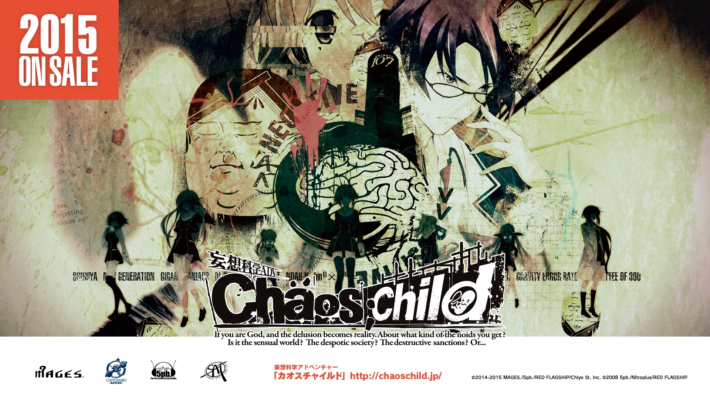
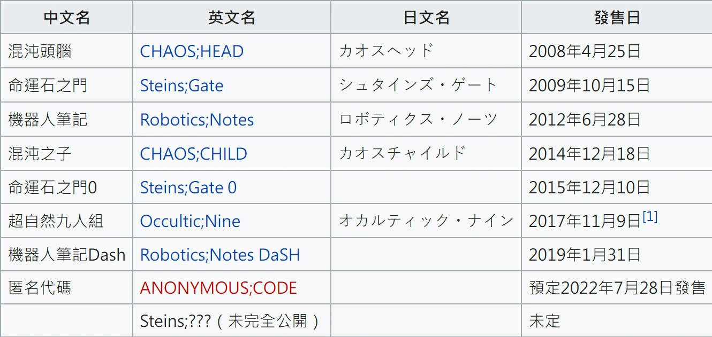
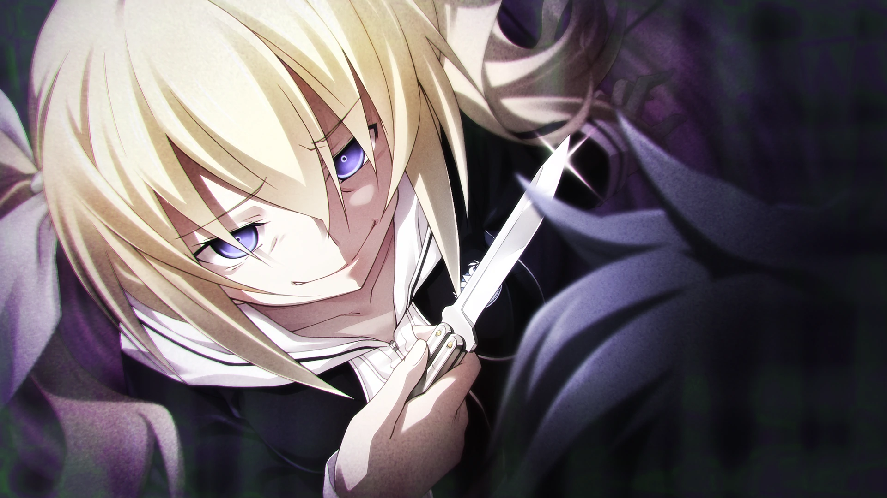
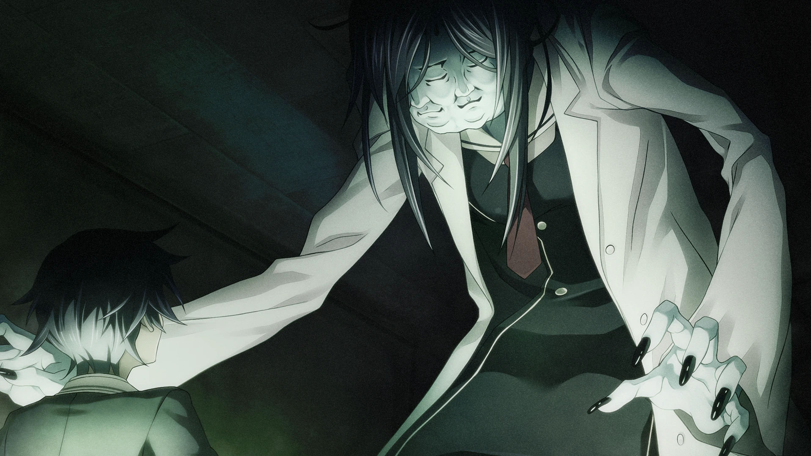
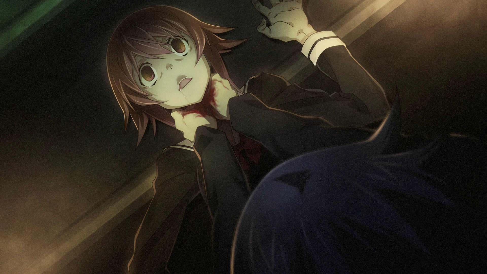
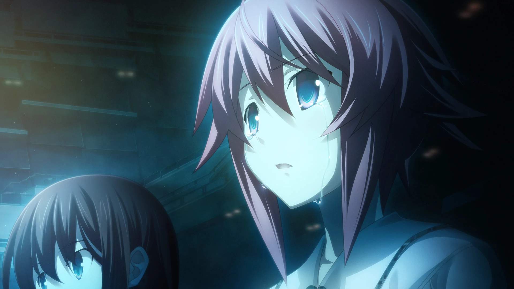
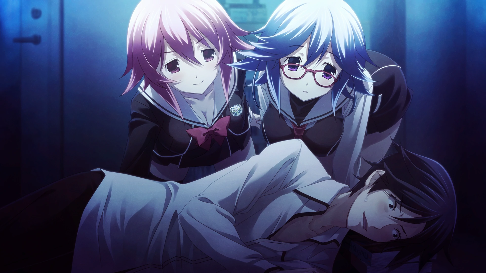
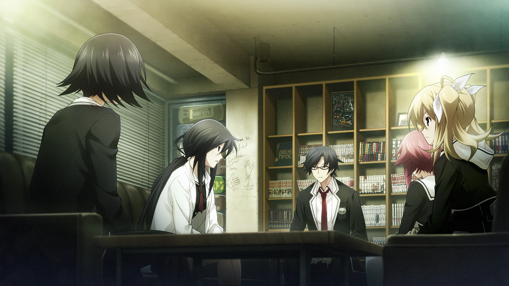
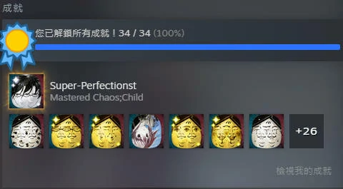

`作者: Patchouli Knowledge`

| 資訊一覽     |                  |
|:--------:|:---------------- |
| **開發商**  | 5pb. （科學ADV系列第四彈）|
| **遊戲時長** | 50 - 60 H          |
| **類型**   | 懸疑 血腥 獵奇 劇情        |
| **難度**   | 較高                |
| **分級**   | 全年齡             |

## 故事梗概

2015年9月7日，一男子在家中直播切下自己的手後死亡，12天後的19號，澀谷的一名街頭歌手當街演出時死亡，且兩者死亡的方式都十分的獵奇……

這樣的事件自然吸引了我們的男主，碧朋學園新聞部部長***宮代拓留***的注意，他馬上開始着手調查這兩起事件，並且發現了這兩起事件與六年前也同在澀谷發生的被稱爲“新時代的瘋狂”連續獵奇殺人案件的時間一致。他馬上找來他的好基友兼新聞部部員***伊藤真二***一起調查，但副部長***來棲乃乃***堅決反對，認爲這只是偶然，更多也是擔心他倆的安全。

就在這時，拓留的手機響了起來，是拓留的青梅竹馬***尾上世莉架***，而事件也正好對應上了“新時代的瘋狂”第三起案件的事發日。
“是不是偶然馬上就知道了……”拓留一行人馬上前往了案發現場。

經典的日本高中生好奇調查案件故事開頭，欲知後事如何，還請進入遊戲品鑑……

## 人物介紹



  

    

      

        

          {name}
        

        

          {yomi}
        

        

      

      

      
  
    

  
  



<sp-character no=0 name="宮代 拓留" yomi="CV: 松岡 禎丞" uid="a">
  

    本作男主，人生信條是“只有掌握了情報纔是強者”，玩家戲稱“情強哥”。 
    然而事實上是一個標準的社恐，只能和社團的人正常交流。 
    正因爲其對情報的無限渴望，纔會投身到獵奇案件的調查當中，“好奇心害死貓”的典範。
  

  

    有一個可愛的青梅竹馬士莉架、偶像般的姐姐乃乃、好基友伊藤和幾個可愛的社團後輩，這不就是標準的人生贏家配置嗎！你這社恐當的也太幸福了……
  

  

    最喜歡的事就是上網衝浪，收集情報。
  

</sp-character>
 

<sp-character no=1 name="尾上 士莉架" yomi="CV: 上坂 堇" uid="b">
  

    男主的青梅竹馬，每天就像跟屁蟲一樣黏在男主身後。 
    和男主的社恐截然相反，是個社牛，和誰都能談得來，很會讀空氣。 
    因爲年幼和男主有類似的經歷故經常一起玩而熟絡起來。
  

  

    是男主拼死拼活也要守護的對象。 
  

</sp-character>
 

<sp-character no=2 name="來棲 乃乃" yomi="CV: 布里德卡特·塞拉·惠美" uid="c">
  

    男主的姊姊，實際上是義姊。 
    校園中被稱爲“女帝”的存在，無論是在男生還是女生中都十分有人氣。 
    十分關心男主，極力反對男主調查危險案件。
  

  

    擁有極強的領導力，說是反對男主調查其實也協助了男主許多工作，什麼事都力求完美，是個經典的完美女強人人設。
  

  

    因爲家庭的緣故做事已經是個成熟的家庭主婦作風，說是姊姊，更像是老媽子。
  

</sp-character>
 

<sp-character no=3 name="山添 羽希" yomi="CV: 水瀨 祈" uid="d">
  

    主角團在調查過程中在醫院地下設施中發現並保護下來的神必少女。 
    似乎一直被隔離在地下設施對外面的世界毫無瞭解。 
    身體停滯在8歲的三無小蘿莉。
  

</sp-character>
 

<sp-character no=4 name="有村 雛繪" yomi="CV: 三森 鈴子" uid="e">
  

    標準的日本JK，文藝部部長。 
    和士莉架一樣擁有極強的社交能力。 
    經典金髮雙馬尾傲嬌形象，在主角團調查案件過程中相識，並加入主角團。
  

</sp-character>
 

<sp-character no=5 name="久野里 澪" yomi="CV: 種田 梨沙" uid="f">
  

    海外大學的腦科學研究所的天才少女。 
    雖然謙虛的自稱不是天才，但對一般人又十分的高傲。 
    擅長在網絡上口嗨，操縱情報，把男主玩弄於鼓掌之間。
  

  

    雖然是天才，但似乎很貧窮，無依無靠。
  

  

    是隔壁助手的後輩兼學生，各種暴言和傲嬌性格都很好的繼承了下來。（兩者年齡設定差距大約有十歲）
  

</sp-character>
 

<sp-character no=6 name="香月 華" yomi="CV: 仲谷 明香" uid="g">
  

    新聞部的後輩，中級電腦高手。 
    超級三無，幾乎不說話，網上打字就很正常。（隔壁萌郁表示贊同） 
    每天就知道在那打電動，偶爾給主角團來點電腦上的協助。
  

</sp-character>
 

## 遊戲 OP

動畫來自被牆的油管和steam，請翻牆



<iframe id='y2b' loading="lazy" src="https://www.youtube-nocookie.com/embed/QftiIuQPS3U" title="YouTube video player" frameborder="0" allow="encrypted-media; picture-in-picture" allowfullscreen></iframe>

## 簡評

首先是對5pb.的科學ADV系列一點小科普：
該系列的每一部作品之間可以說毫無聯繫，但都是發生在同一個世界觀之下（比如該作的久野里澪是石頭門的女主克里斯提娜的學生，遊戲中並未提及），並且反派都爲“三百委員會”，其影響力巨大並企圖通過各種”超能力“掌控世界。

該系列的核心就是：***”拯救世界的，不是英雄，而是宅“***

  
優點：

  </img>

 * 5pb.一貫的高水準劇本發揮，共同線和TE劇情做的非常優秀，劇情一環扣一環，前期調查各種死法詭異案件時氣氛烘托的非常好，絕對的消暑神器。
 * 豐滿的劇情帶來的就是人設的飽滿，一層層剝開事情的真相，俗話說得好：優秀的美少女遊戲賣的都是男主人設。（我現遍的俗話）
 * CV陣容拉滿，似乎5pb.的CV陣容一直都很不錯。 
 

  
缺點：

  </img>

 * 一部分個人線有些莫明其妙，邊緣角色偏臉譜化，意義不明，但不太影響整體遊戲質量。
 * 部分劇情過於血腥、掉san，心理承受能力較差的玩家慎重。（前期我真的當恐怖遊戲來玩的）

石頭門系列官方命名爲“假想科學”，而該系列則是“妄想科學”，這個形容是十分恰當的，這系列的主基調更加偏向妄想，與科學沒啥關係。回到遊戲質量上，不要抱着和石頭門同樣的期望值來遊玩，不然你會有一點點失望，用一個詞來形容該作就是“虎頭蛇尾”。

該作的前半段筆者絕對可以給到滿分，極佳的氣氛烘托，一個又一個的伏筆埋下，令人直呼過癮，案件現場的CG也是張力拉滿，但逐漸將真相解釋後落差感還是有的，不是說一拉到底，但對比前期真的有些遜色，再加上巨大的文本量，放大了這種感受。後半部分的劇情如果單獨出一個遊戲我可以給到8分，但和前期一對比就只能給到7分，故最後綜合給了8分的劇情，離最頂尖的那批劇情作還是差點意思。

| 評分        |      |
|:---------:|:----- |
| **人設**    | 9/10 |
| **立繪 & CG** | 9/10 |
| **劇情**    | 8/10 |
| **音樂**    | 8/10 |
| **綜合**    | 8/10 |

## CG鑑賞


../image/chaoschild/09.webp
../image/chaoschild/10.webp
../image/chaoschild/11.webp
../image/chaoschild/12.webp
../image/chaoschild/13.webp
../image/chaoschild/14.webp


## 遊戲資源



steam暫無中文，可以用盜版替換大法（可以跳steam成就）

盜版： 

