<style>
.ar4x3 {
  aspect-ratio: 4/3;
}
.ar8x3{
  aspect-ratio: 8/3;
}
body {
    background: var(--bg-url) no-repeat fixed center;
    background-size: cover;
    /*-webkit-font-smoothing: unset;*/
}
#banner {
    background: url('')!important;
    background-color: transparent!important;
}
#toc {
     background-color: var(--board-bg-color);
     padding: 20px 10px 20px 20px;
     border-radius: 10px;
}
#board {
    backdrop-filter: blur(5px);
    -webkit-backdrop-filter: blur(5px);
   /* background-color: #3337 !important;*/
}
.full-bg-img > .mask {
  background-color: rgba(0,0,0,0) !important;
}
.page-header  {
  background-color: rgba(0,0,0,0.5);
  padding: 3px;
  border-radius: 5px;
}
:root {
  --board-bg-color: rgba(255,255,255,0.85);
  --bg-url: url('../image/subahibi/long-bg.webp');
  --name-select-color: #4d8aff;
  --delayed-opacity: 0;
}
[data-user-color-scheme='dark'] {
  --board-bg-color: rgba(0,0,0,0.80);
  --bg-url: url('../image/subahibi/bg-d.webp');
  --name-select-color: violet;
}
::selection {
    /*background-color: #f00;*/
}
.page-header .mt-1 span.post-meta {
    /* 隱藏嚇人的字數統計 */
    display: none;
}
#carousel-cover {
  aspect-ratio: 100/71;
}
/* show later */
.page-header, #board, .scroll-down-bar, #toc  {
  opacity: var(--delayed-opacity);
  transition: opacity 0.3s;
}
</style>

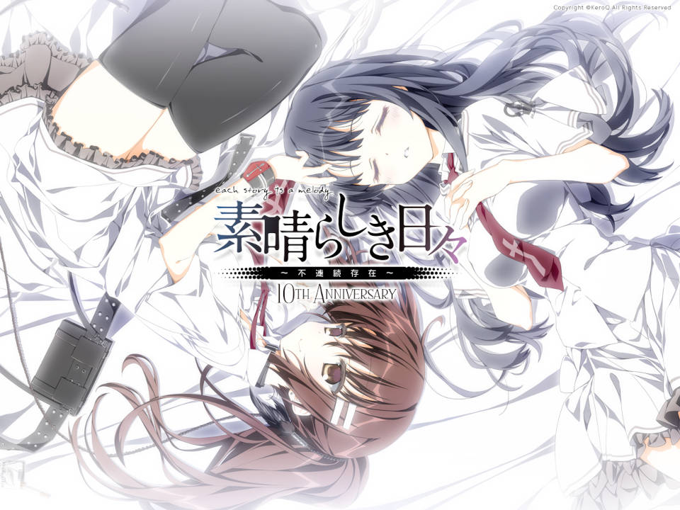


`作者：Kimika`

## At A Glance

歡迎來到素晴日々安利文章。


../image/subahibi/cover.webp
../image/subahibi/master.webp
../image/subahibi/master03.webp


<br>

| 資訊一覽     |                 |
| :----------- | :------------------------------------ |
| **開發商**   | ケロQ           |
| **遊戲時長** | 35H（估計）                     |
| **攻略人數** | 0                     |
| **章節數**   | 7                     |
| **難度**     | 高<br>（解鎖所有結局需要攻略，<br>并且敘事過程可能令人看不懂）    |
| **分級**     | R-18（性行爲，犯罪，殘酷）      |
| **遊戲引擎** | BURIKO General Interpreter   |


<div class="alert alert-success" role="alert">
  <span class="alert-heading font-weight-bold" style="font-size: 125%;">第一印象</span><br>
  <p>
    本游戲作爲十二神器裏面最出名的一部，吸引了很多人慕名而來，<br>
    但是網上各種語焉不詳的介紹卻讓人摸不着頭腦，不知道這個游戲是否適合自己玩。
  </p>
  <p>
    就像還沒玩過這游戲時候的我，詢問群友 <strong><em>Patchouli Knowledge</em></strong> 這游戲是幹嘛的，好玩嗎的時候，他也沒給我説出個所以然來。<br>
    所以我想用這篇文章 在避免劇透的同時給群友建立一個第一印象，幫助大家決定要不要去玩這個游戲。
  </p>
</div>

***『素晴らしき日々 \~不連続存在\~』***（以下簡稱***素晴日々***）這款游戲十分的獨特，所以俺決定重新安排文章的結構，
先從大家可能關心的問題開始回答好了。

## FAQ：常見問題

**Q：素晴日々 這個游戲爲什麽在十二神器裏面這麽出名？**
A：這個游戲的特點在於其非常獨特的敘事手法和劇情安排。從一個通關的人的角度來看，本作的劇情其實并不複雜，就是一連串戲劇性的故事。
但是在講述這個故事的時候，使用了各種掐頭去尾，添油加醋，插入哲學甚至讓劇中人物大腦降級，對眼前發生的事情視而不見等手法，
最後讓整個過程變爲地獄笑話。

**Q：美好的每一天 是什麽意思？指的是什麽？**
A：説實話我玩完了也不太清楚，有可能指的是和朋友一起的美好日常，也可能指的是如果沒遭到那件壞事的話，本來應該存在的美好日常。

**Q：不連續的存在 是什麽意思？指的是什麽？**
A：這句話屬於老玩家的自嗨，對新玩家沒有特別的意義。

**Q：我不懂哲學能玩嗎？**
A：可以，你甚至可以在劇中人物開始扯哲學歷史文學的時候按 Ctrl 快進，不影響游玩，雖然這樣會少一點神必氣氛 并且可能會錯過第三章主角黑屁***毛臘肉***的黑色幽默，，，

**Q：久闻大名，请问推完它可以提高自己的格局吗？**
A：恐怕不行，有一部分人甚至會陷入我 tm 爲什麽要玩這個游戲的自我懷疑之中，，，

**Q：我已經雲玩家雲完了，還有必要去自己推一遍嗎？**
A：那還推個🔨，有這時間不如去玩紙上的魔法使。

**Q：所以這游戲到底是幹嘛的？**
A：別催，先來看一下 CG 瞭解一下游戲的氣氛，，，

## 遊戲 CG

<div class="row m-1">
  <div class="col-12 col-md-6 p-1 round">
    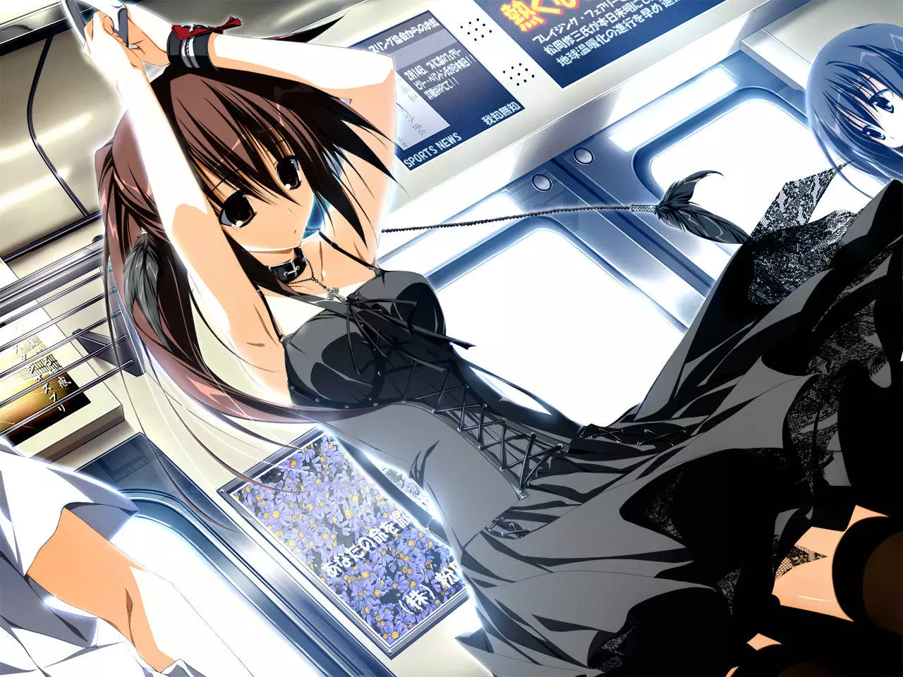
  </div>
  <div class="col-12 col-md-6 p-1 round">
    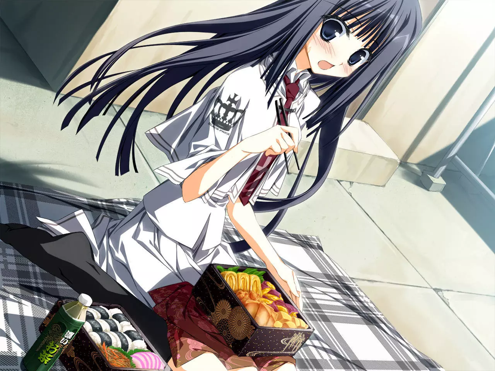
  </div>
  <div class="col-12 col-md-6 p-1 round">
    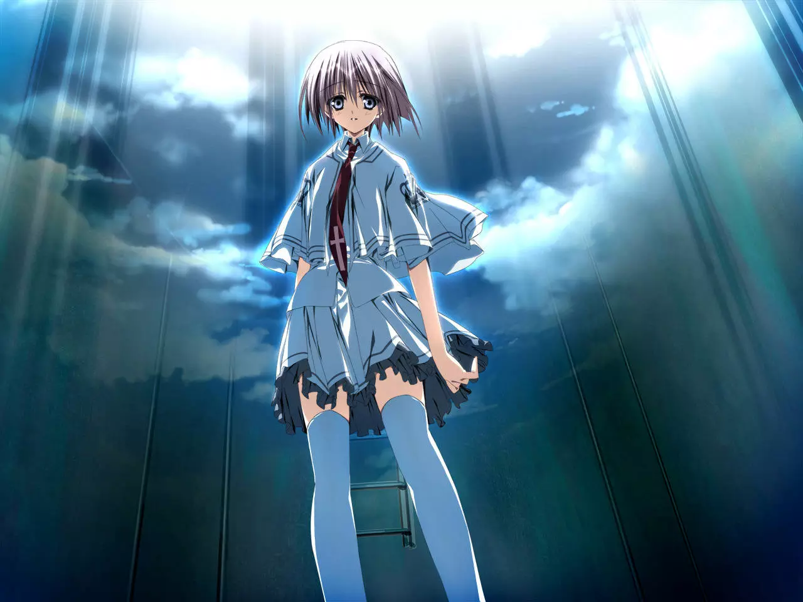
  </div>
  <div class="col-12 col-md-6 p-1 round">
    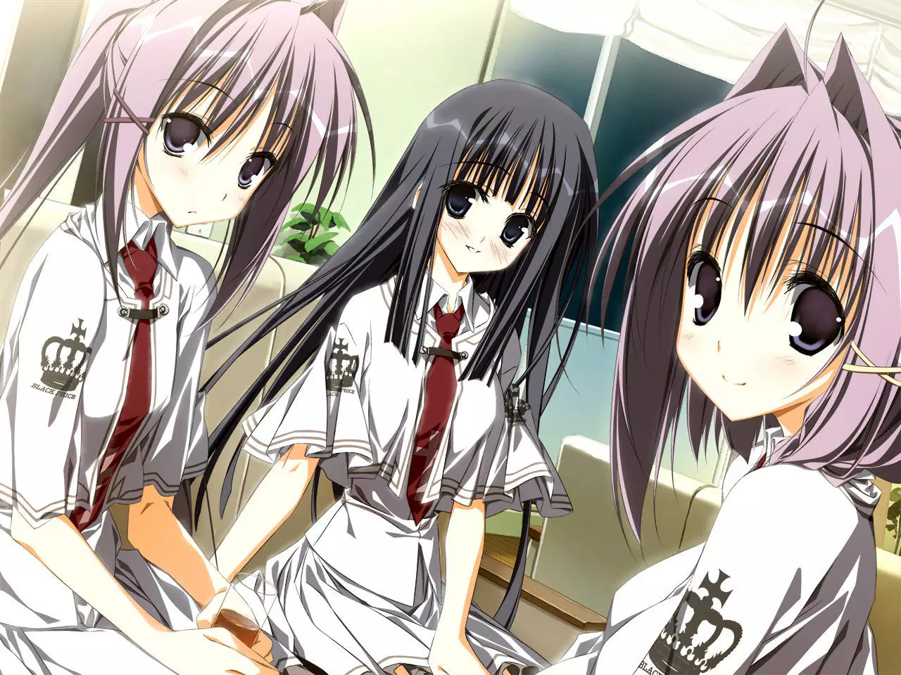
  </div>
  <div class="col-12 col-md-6 p-1 round">
    
  </div>
  <div class="col-12 col-md-6 p-1 round">
    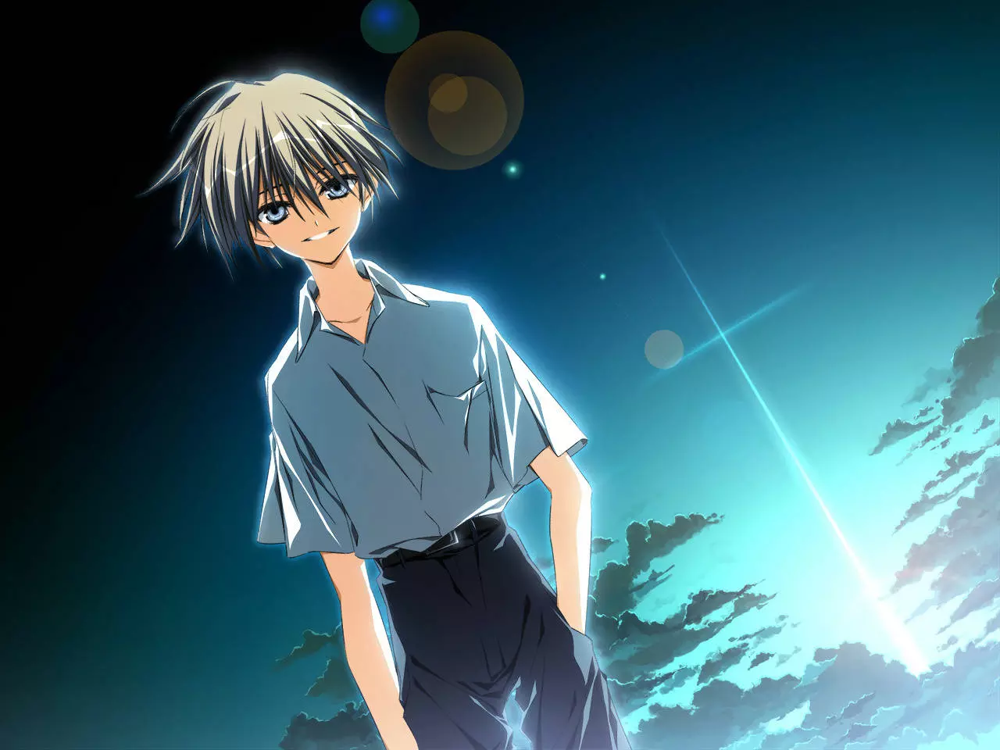
  </div>
  <div class="col-12 col-md-6 p-1 round">
    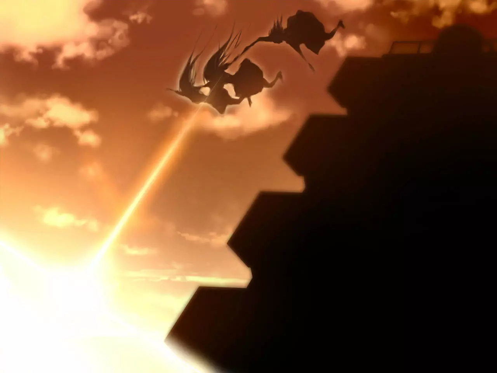
  </div>
  <div class="col-12 col-md-6 p-1 round">
    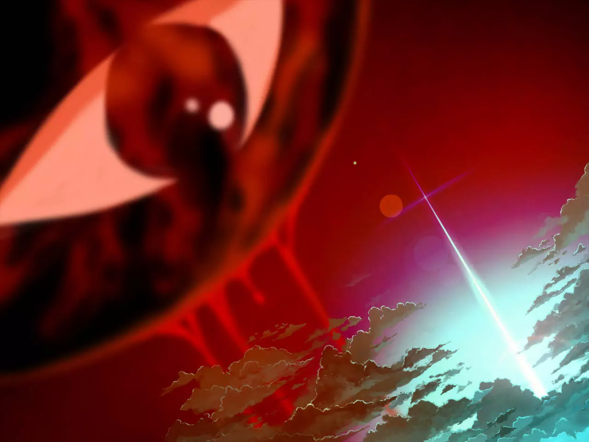
  </div>
  <div class="col-12 col-md-6 p-1 round">
    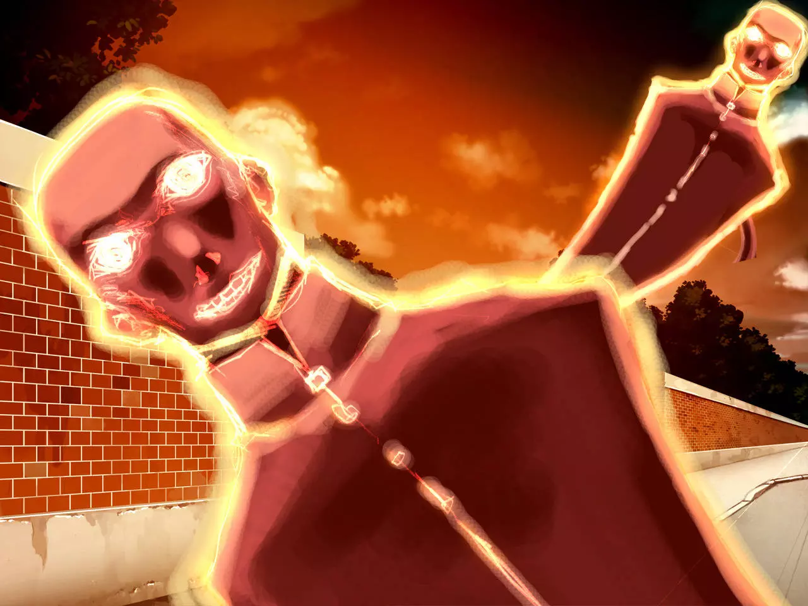
  </div>
  <div class="col-12 col-md-6 p-1 round">
    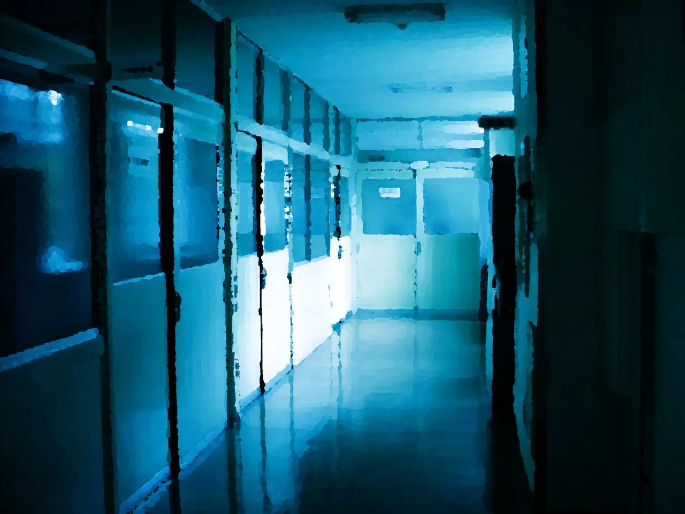
  </div>
</div>


請記住劇中人物長什麼樣，然後接下來簡單講一下遊戲的故事，，，

## 故事（少量劇透序章，不影響遊玩）

這個世界就是一個巨大的牢籠，然後這是一個從牢籠之中掙脫的故事。而世界的意義僅存在於世界之外，因此在牢籠之中的人不知道自己身處牢籠之中。
*翻譯成人話：人們只有掙脫出這個世界，回過頭來，才能最終理解到底是什麽發生在了自己身上。*

<p>
  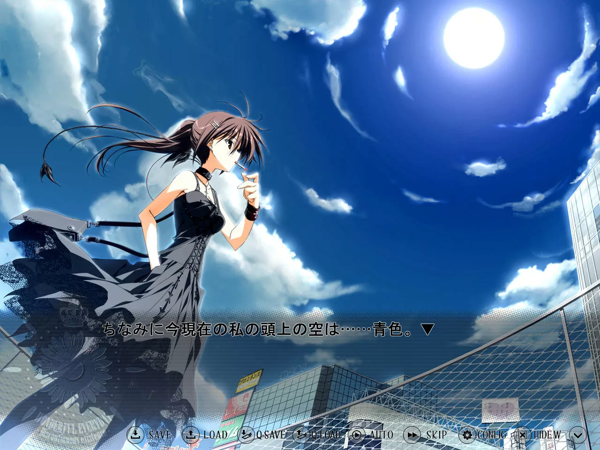
</p>

文武雙全，頭腦靈光，觀察力洞悉一切的完美美少女***水上由岐***（唸作 Yuki）有時候會進入賢者狀態，
比如説站在樓頂上一邊抽著菸 一邊對著天空感嘆<span class="text-danger">「靠北喔天空怎麽那麽藍，那麽大，就像延伸到了世界的盡頭，讓我有點害怕」</span>
然後感嘆完下一秒 Yuki 就上街去買碟了。

在地鐵站前面的 Yuki 碰到了青梅竹馬的兩人，住在隔壁的雙胞胎女孩，傲嬌的***鏡***和溫柔的***司***，
誰讓 Yuki 是一個完美的美少女，讓鏡忍不住發射 SukiSuki 光波！喜歡得不得了呢，Yuki 就開始有恃無恐地捉弄鏡，
然後惱羞成怒的傲嬌鏡炸了，拖著司氣呼呼地走了。

<p>
  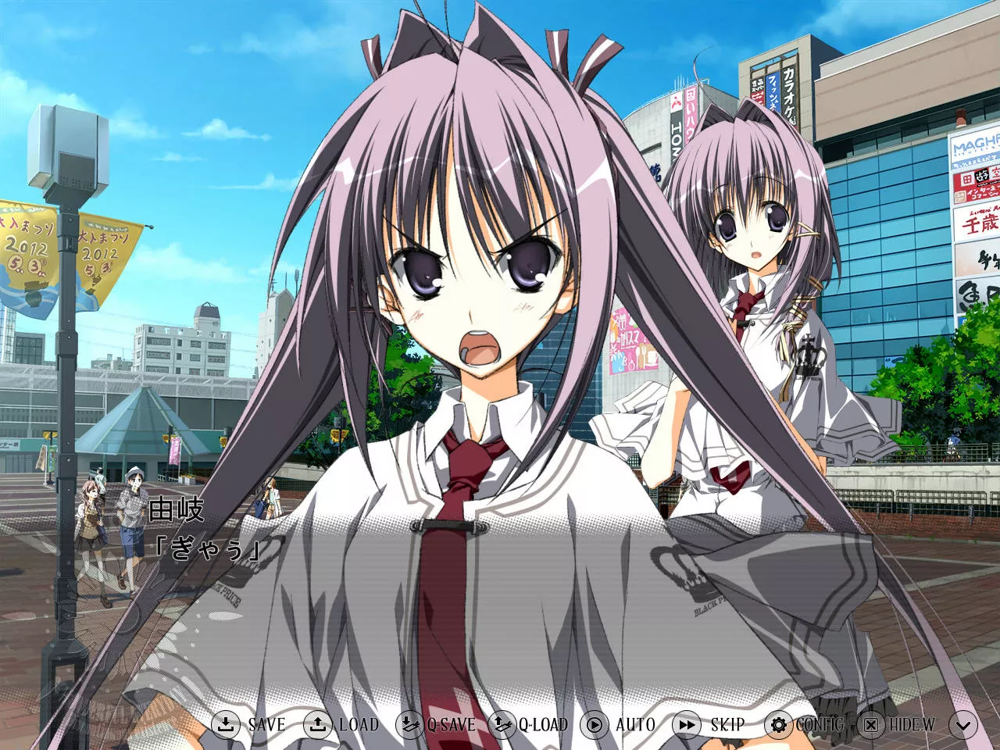
</p>

Yuki 找着 CD 店，在路過了一棟公寓樓的時候，突然脊背一涼感覺大事不妙，擡頭一看，
靠腰居然有人飛在半空中，還有另外一個人站在樓頂的邊緣搖搖欲墜！有人跳樓！
Yuki 火速衝進電梯，衝上樓頂，然後看到了一個正準備跳樓的少女***高島石榴***。

<p>
  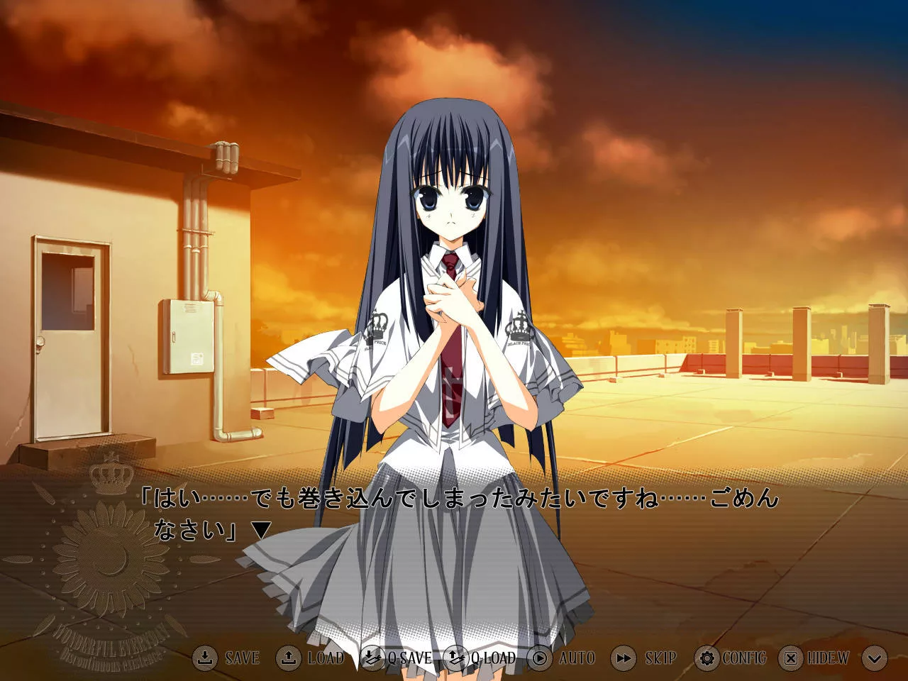
</p>

Yuki 剛準備質問你在幹什麽的時候，才發現高島正拿著毛絨玩偶往樓下扔，還以爲是有人跳樓呢，嚇死我了。
<span class="text-danger">「你在幹什麽呢？？」</span>Yuki 質問道。
<span class="text-danger">「我在讓世界少女和天空少女相會。」</span>高島回答道。
接着嘴裏還一邊説著什麽<span class="text-danger">「夏夜的大三角形」</span>之類的令人琢磨不透的話，
Yuki 心想，這神經病要是放著不管怕是會真跳樓，就説<span class="text-danger">好好，我幫你一起找世界少女和天空少女，你跟我來。</span>於是高島就被帶回了 Yuki 家。

<p>
  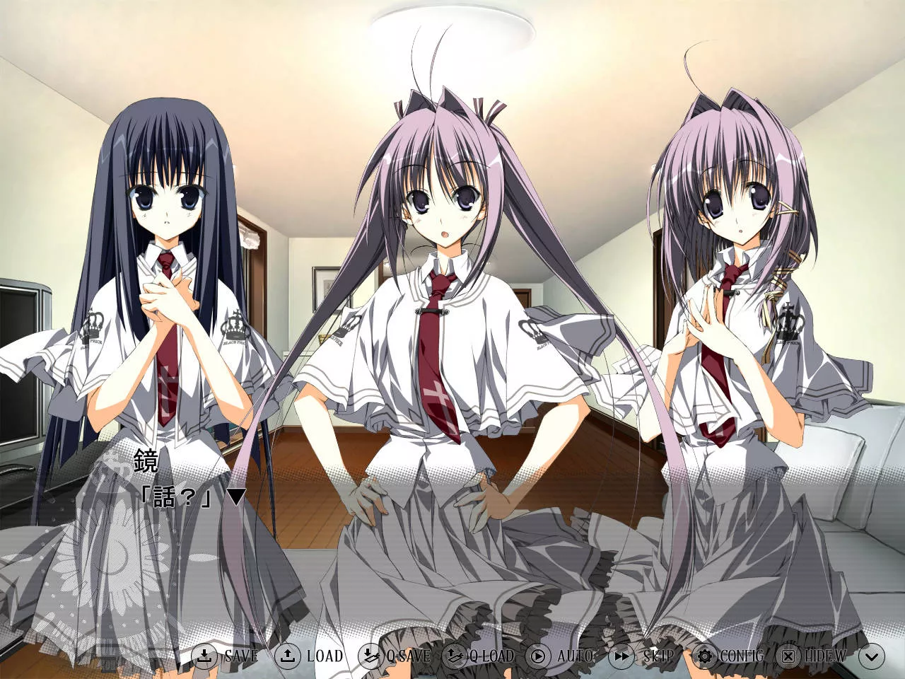
</p>

傲嬌鏡看到 Yuki 家竟然進了別的女人，就開始抗議，說我們也要住 Yuki 家！
然後四人一起洗澡，一起睡覺，一起找天空少女和世界少女，直到了暑假結束的那一天。

高島說，<span class="text-danger">和你們度過暑假讓我很快樂，Yuki 你快跟我來，我給你看點大的。</span>
然後高島就把 Yuki 拉上了銀河俠盜(鐵道)列車，穿過了宇宙中各種各樣的星雲，最後升天了，，，

<p>
  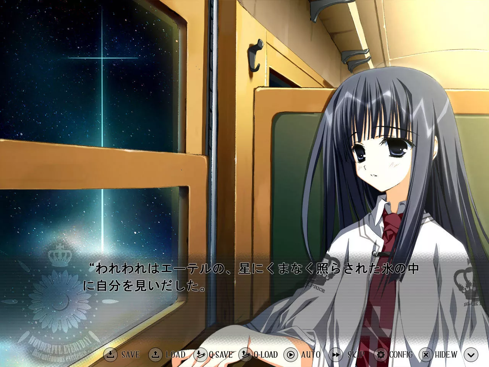
</p>

Yuki 從夢中驚醒，我不是要買碟嗎！居然真的沉浸在了藍天之中，於是 Yuki 火速趕往地鐵站。
在地鐵站她又遇到了***高島石榴***，沒想到高島二話不說直接親了過來！親完就跑路了。

留下在原地不知所措的 Yuki。

<p>
  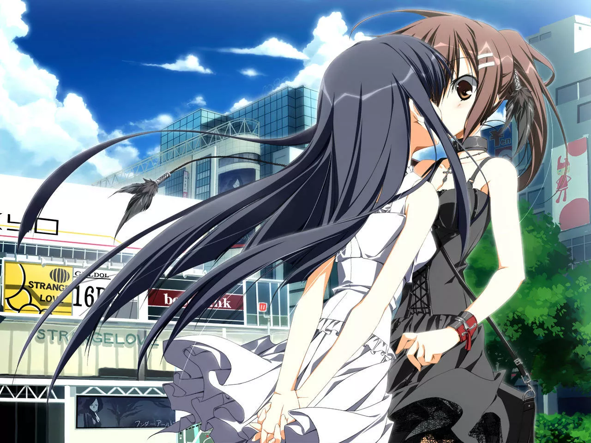
</p>

第二天 Yuki 回到學校，卻發現整個學校已經籠罩在了恐懼之中，向同學打聽了才得知昨天還在和我親嘴的高島石榴已經在昨晚跳樓自殺。

雖然疑點重重外加流言漫天，但洞悉一切的完美少女 Yuki 並不吃這一套，於是開始著手調查此事，
但是無論她如何調查，總是離真相只有一步之遙，就如同是可望不可即的鏡中世界，真相在無法企及的鏡面的那一側。

這個世界就是一個巨大的牢籠，然後這是一個不斷從牢籠之中掙脫的故事。而世界的意義僅存在於世界之外，因此在牢籠之中的人不知道自己身處牢籠之中，
無論是在夢中世界還是現實世界。

## 登場人物

<style>
  .charname {
    font-size: 150%;
  }
  .namearea hr {
    margin: 1.5rem 0;
  }
  .sp-character img, .img-shade {
    filter: drop-shadow(0 0 6px #000c);
  }
  .sp-character {
    border-radius: 20px;
    overflow: hidden;
    box-shadow: 0 5px 11px 0 rgb(0 0 0 / 18%), 0 4px 15px 0 rgb(0 0 0 / 15%);

    /*-webkit-backdrop-filter: blur(1px);
    backdrop-filter: blur(1px);
    
    background-color: var(--chara-card-color);*/
    
    background-color: transparent;
    background-image: var(--this-bg);
    background-position: center;
    background-repeat: no-repeat;
    background-size: cover;

  }
  .sp-character .char-overlay {
    background-color: var(--chara-card-color);
    min-height: 400px;
    background-image: var(--right-bg);
    background-repeat: no-repeat;
    background-position: top 0 left calc(100% * 0.2 - 120px);
    background-size: 325px;

    margin: 0;
    padding: 0;
  }
  :root { /* 配色 */
    --chara-card-color: #ffffffcf;
  }
  [data-user-color-scheme='dark'] {
    --chara-card-color: #1a1a1aa6;
  }
  @media screen and (max-width: 767px) {
    .namearea hr {
      margin: 1rem 0;
    }
    .pc-right {
      -webkit-backdrop-filter: blur(3px);
      backdrop-filter: blur(3px);
      
      background: var(--chara-card-color);
      transition: opacity 0.3s;
    }
    .pc-right.touch {
      opacity: 0.05;
    }
    .sp-character {
     /*background: unset;*/
      /*-webkit-backdrop-filter: unset;
    backdrop-filter: unset;*/
    }
    .sp-character .char-overlay {
      min-height: unset;
      background-size: 320px;
      background-position: top 0px left 0px;
    }
    :root { /* 配色 */
      --chara-card-color: #ffffff87;
    }
    [data-user-color-scheme='dark'] {
      --chara-card-color: #1a1a1aa6;
    }
  }
</style>


<div class={`row sp-character ${uid}`} style={`--this-bg: url(../image/subahibi/chars/b${no}.webp)`}>
  <div class="col-12 char-overlay row" style={`--right-bg: url(../image/subahibi/chars/0${no}.webp)`}>
    <div class="pc-right col-12 col-md-8 ml-auto">
      <div class="namearea col-12 pt-2 px-2">
        <div class="charname font-serif font-weight-bold font-italic">
          {name}
        </div>
        <div class="yomi font-italic">
          {yomi}
        </div>
        <hr class="my-2" />
      </div>
      <div class="infoarea col-12 px-2" html={html}>
      </div>  
    </div>
  </div>  
</div>


<sp-character no=0 name="水上由岐" yomi="Yuki" uid="Yuki">
  <p>
    女主角，家裏外公是開道場的，<br>
    因此 Yuki 武力值很高，動手 K 人毫不猶豫。<br>
    絕對的武力就是絕對的自信，這塑造了她開朗率真，嫉惡如仇的性格。
  </p>
  <p>
    在劇中是帶有男子氣概的大姐姐，無論男生女生都喜歡她。
  </p>
  <p>
    在調查「自殺事件」的時候展現出了超高的行動力，無論是真人快打還是網上衝浪都毫不手軟。<br>
    只不過她的障礙是「世界」。
  </p>
</sp-character>
<br>
<sp-character no=1 name="高島石榴" yomi="Zakuro" uid="Zakuro">
  <p>
    太過於溫柔以至於軟弱的少女，是 Yuki 她們的隔壁班的同學。<br>
    如此軟弱的人一旦被捲進學校的黑暗面就毫無還手之力，導致了跳樓的悲慘結局。
  </p>
  <p>
    這個社會多多少少有點病入膏肓，平常就像滿是 bug 卻能跑起來的代碼一樣風平浪靜，<br>
    卻被高島的死掀翻了風平浪靜的表面，帶向了瘋狂宇宙。
  </p>
  <p>
    （有時候我看她那慫樣都想錘牠）
  </p>
</sp-character>
<br>
<style>
  .wakatsuki.left .char-overlay{
    --right-bg: url(../image/subahibi/chars/02.webp);
  }
  .wakatsuki.left .kagami {
    color: var(--name-select-color);
  } 
  .wakatsuki.right .char-overlay{
    --right-bg: url(../image/subahibi/chars/03.webp);
  }
  .wakatsuki.right .tsukasa {
    color: var(--name-select-color);
  }
</style>
<div class="row sp-character wakatsuki left" style="--this-bg: url(../image/subahibi/chars/b2.webp)">
  <div class="col-12 char-overlay row">
    <div class="pc-right col-12 col-md-8 ml-auto">
      <div class="namearea col-12 pt-2 px-2" style="cursor: pointer;">
        <div class="charname font-serif font-weight-bold font-italic">
          <span class="kagami">若槻鏡</span> & <span class="tsukasa">若槻司</span> 
          <span class="namespin">⇦</span>
        </div>
        <div class="yomi font-italic">
          <span class="kagami">Kagami</span> & <span class="tsukasa">Tsukasa</span>
        </div>
        <hr class="my-2" />
      </div>
      <div class="infoarea col-12 px-2">
        <p>
          Yuki 家隔壁的雙胞胎女孩，<br>
          三人既是一起長大的青梅竹馬，也是同班同學。<br>
          因爲 Yuki 很能打，所以兩人要是出了啥事都是讓 Yuki 來擺平，<br>
          因此她們也越來越喜歡 Yuki。
        </p>
        <p>
          兩人會和 Yuki 一起上學，一起吃便當，<br>
          並且 Kagami 是傲嬌雙馬尾，被 Yuki 稍微捉弄一下就會炸，炸了以後溫柔的司就會來安撫。<br>
        </p>
        <p>
          兩人相當可愛，導致 Tsukasa 甜甜地叫了一聲 Yuki 我就 doki，只可惜這遊戲並不是萌豚戀愛，我的 Kagami，，，
        </p>
      </div>  
    </div>
  </div>  
</div>

### 其他人物

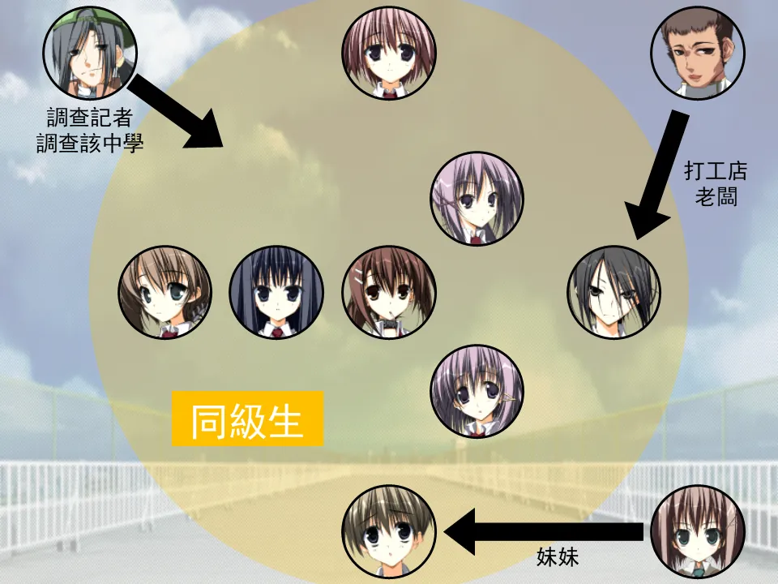

## 路線圖

<div class="route-map">
  <x-row>
      <x-col src="../image/subahibi/route/route1.webp"/>
      <x-col src="../image/subahibi/route/route2.webp"/>
      <x-col src="../image/subahibi/route/route3.webp"/>
      <x-col src="../image/subahibi/route/route4.webp"/>
      <x-col src="../image/subahibi/route/route5.webp"/>
      <x-col src="../image/subahibi/route/route6.webp"/>
  </x-row>
  <p> JavaScript 錯誤，無法顯示路線圖</p>
</div>

簡單來說，本作前三章出題，後三章解謎，如果你已決定要玩，請務必玩完第三章 *Looking-glass Insects*。

## 一句話點評

都寫到這裏了，就來回答一下這個問題吧：

**Q：所以這游戲到底是幹嘛的？**
A：沒玩過的新玩家可以直接把**素晴日々**當成一個摻雜了各種哲學思考和地獄笑話要素的解謎遊戲。

在玩這個遊戲之前，我處於那種久聞本作大名，稍微有點在意的狀態，但是並沒有很想玩，
主要是因爲畫風看上去有點陳舊（陳舊到不像是一個 2010 年的遊戲），
並且官網的故事介紹語焉不詳，什麼「每一個故事都是旋律」天知道是什麼鬼意思，，，

而且俺不太喜歡看網上的介紹，因爲很多網站都是直接丟個從官網抄過來的土製翻譯外加一個壓縮包，（俺根本就不缺壓縮包好吧）
要不就是動漫婆羅門爭當素學家故弄玄虛，要麼就是全部一瞬劇透完畢。
所以當時我是完全不知道這個遊戲是什麼故事。

讓我入坑的契機是，我看到群友在 Steam 上買了 ***Wonderful Everyday***，要知道這玩意是英文的，
牠明顯是可以玩盜版卻還是補了票，俺相信群友的品味，所以就下了十週年紀念版來試玩了一下。

畫風是有點陳舊，但是看多了卻覺得怪可愛的（除了該死的高島石榴），BGM 也非常動聽應景。
故事組織上由於插入了太多哲學，總是讓我忍不住想要退坑，但是最終還是通關了，因爲解謎要素還是很精彩的。

要問我玩完這個遊戲感覺怎麼樣，我感覺我絕對地中立，既沒有很後悔也沒有很相見恨晚，畢竟俺被迫啃了一嘴莫名其妙的哲學，但是與此相對的，故事還是挺神的，作爲神器當之無愧。

希望這篇文章能讓你決定要不要去玩這個遊戲。

## 遊戲 OP

動畫來自被牆的 Steam。
但是十週年紀念版居然用的還是和這個一樣的老 OP，連 LOGO 都不換一個。

<style>
  .steamwrap video {
    aspect-ratio: 4/3;
  }
</style>
<div class="col-lg-10 col-auto steamwrap">
  
</div>

OP 看上去很歡快，但是實際上不是這樣的，，，

## R-18 場景


../image/subahibi/cg/r18/3.webp
../image/subahibi/cg/r18/9.webp
../image/subahibi/cg/r18/a.webp
../image/subahibi/cg/r18/c.webp


## 遊戲畫面

<p>
  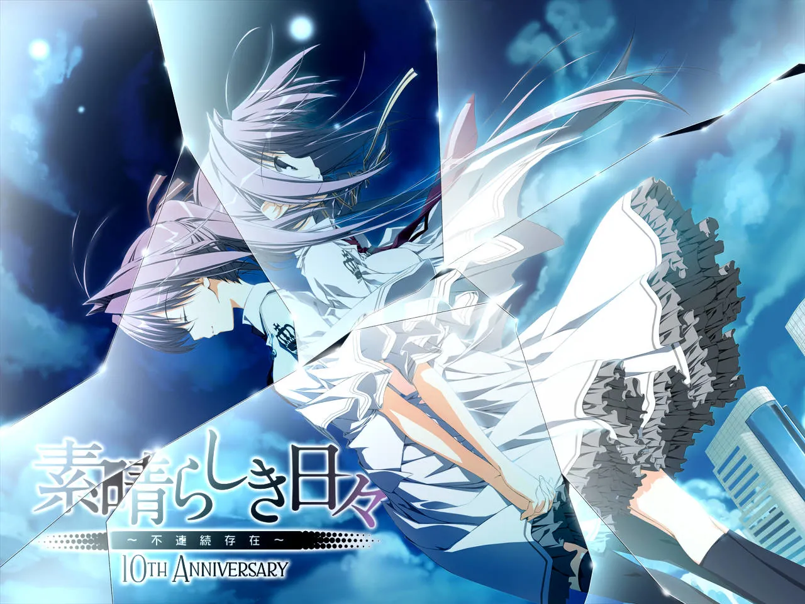
</p>

<p>
  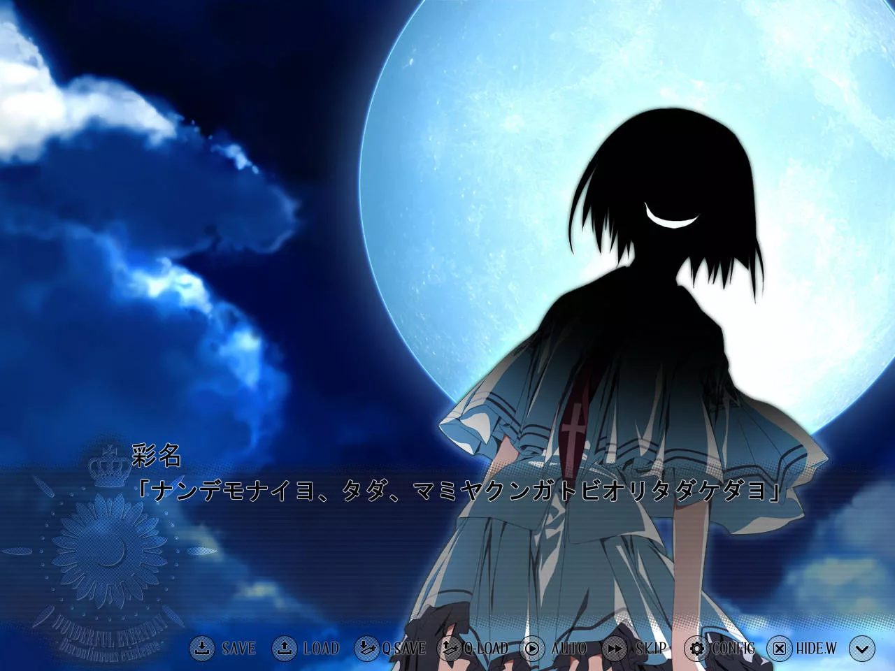
</p>

<p>
  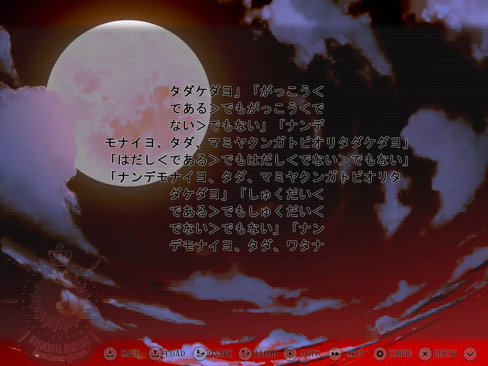
</p>

<p>
  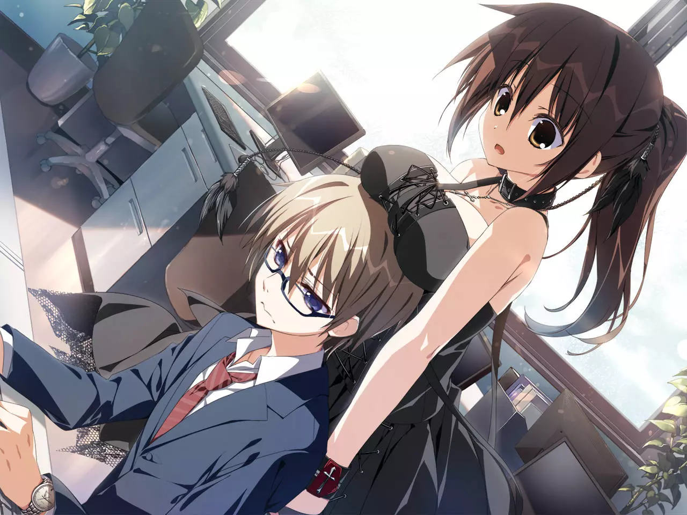
</p>

## 游戲版本介紹

素晴日々有多個版本，各版本之間的區別如下所示

|                    |    **原版**           |     **Steam 版**    | **Full Voice HD 版** |  **十週年紀念版**   |
| :----------------- | :-------------------- |:------------------ |:---------------------|:------------------ |
| **年份**           |  2010                 |    2017            |   2018               |   2020              |
| **語言**           |  日語                 |     英語            |    日語              |   日語              |
| **有漢化？**       |   有                  |     無              |     有               |    無               |
| **全人物語音？**    |   部分人物語音         |   我不知道          |   有                 |      有             |   
| **分辨率**         |   800x600             |      1280x960       |    1280x960         |   1280x960          |
| **推薦？**         |                       |                     |     推薦             |    推薦             |

現在的人一般玩的是 2018 年的 Full Voice HD 版，因爲有漢化補丁，建議普通玩家玩這個版本。
Steam 版是英文的，而且翻譯有點怪，另外需要打 R-18 補丁才能享受到全內容，所以不太建議玩，當然買來支持遊戲公司也是可以的。

我玩的是十週年紀念版，該版有重製過的更好看的 UI，但是由於沒有漢化補丁外加大量哲學，所以讀起來會比較費勁。

## 還在猶豫是否下載？

我手上只有十週年紀念版，因此是日文的。當然你聽一下 BGM 也是極好的。

<video controls preload="metadata" width='100%' poster="../image/subahibi/cover.webp">
  <source src="https://s3static-zone0.galgamer.eu.org/video-2d35/subahibi/subamovie.mp4" type="video/mp4" />
  <p> To view this video please enable JavaScript</p>
</video>

## 資源和下載

先放一個 Steam 連結。



然後是 **Full Voice HD 版**的遊戲本體的磁力連結（第二個是備用防止失效）

```
magnet:?xt=urn:btih:4ac46b4266af02b2c4fdb1686638c96f32456ba4
magnet:?xt=urn:btih:a3949b9d1b5f7fa5592d6487c0b4f514e0bb2beb
```

以及漢化補丁（還有一個無碼補丁，但是我沒用過，請自己嘗試）

<p>
  
</p>


最後是**十週年紀念版**的磁力連結

```
magnet:?xt=urn:btih:b65a3001ff57d54a660536dbb3dd2d818ed73e96
```

這個就是終之空那篇文章的種子，內含

* 素晴日々十週年紀念版
* 終之空 remake
* 終之空 1999 原版

共三個遊戲的官方光盤鏡像 ISO。

附贈一些我拆包時候拆出來的高清壁紙：


## Wonderful Everyday meme

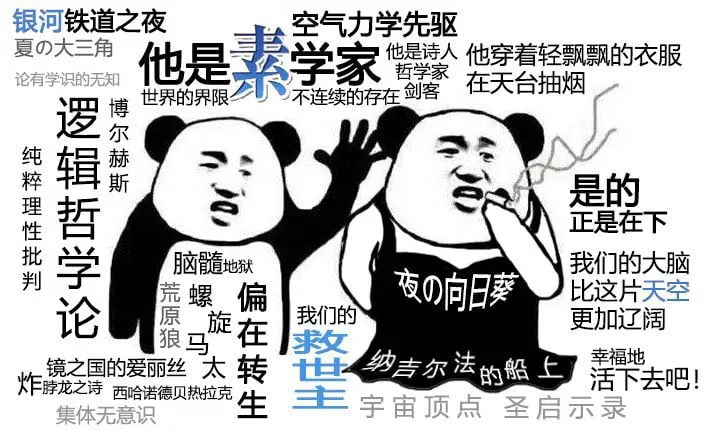

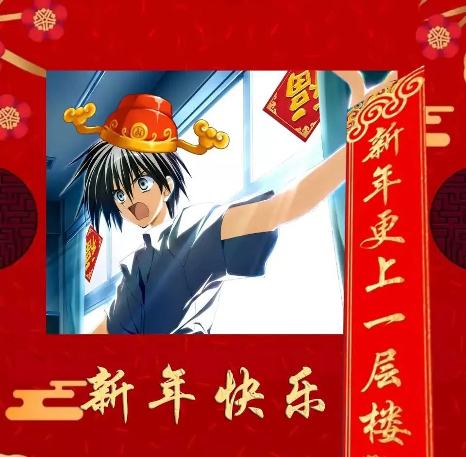


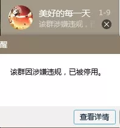


<script>
  //document.documentElement.setAttribute('data-user-color-scheme', 'dark');
  document.addEventListener("DOMContentLoaded", function(){
    let pcrights = document.querySelectorAll('.pc-right');
    pcrights.forEach((el) => {
      el.addEventListener('touchstart', function(){
        el.classList.add('touch');
      })
      el.addEventListener('touchend', function(){
        el.classList.remove('touch');
      })
    });
    let wakatsuki = document.querySelector('.sp-character.wakatsuki');
    let wakatsukiName = document.querySelector('.sp-character.wakatsuki .namearea');
    wakatsukiName.addEventListener('click', function () {
      if(wakatsuki.classList.contains('left')){
        wakatsuki.classList.remove('left');
        wakatsuki.classList.add('right');
      }else{
        wakatsuki.classList.remove('right');
        wakatsuki.classList.add('left');
      }
    })
    setTimeout(() => document.documentElement.setAttribute('data-user-color-scheme', 'light'), 500);
    setTimeout(function(){
      document.documentElement.style.setProperty('--delayed-opacity', 1);
    }, 2000);
  })
</script>
