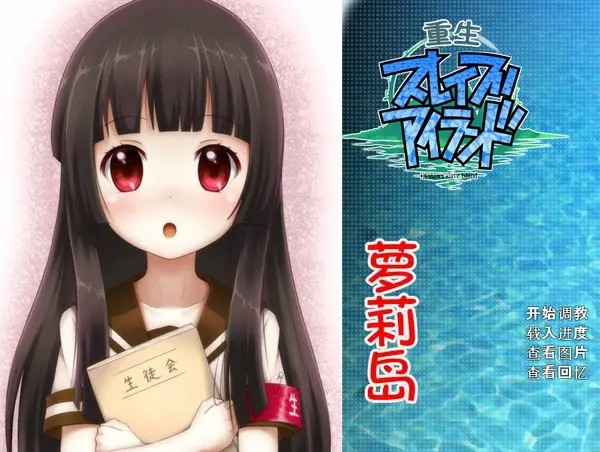
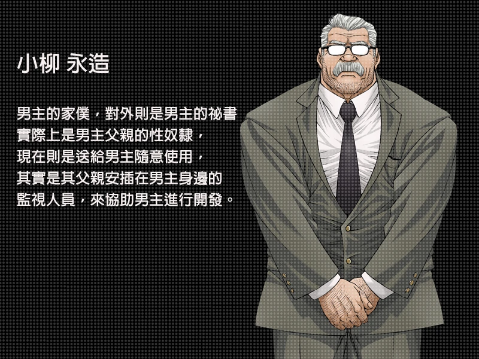
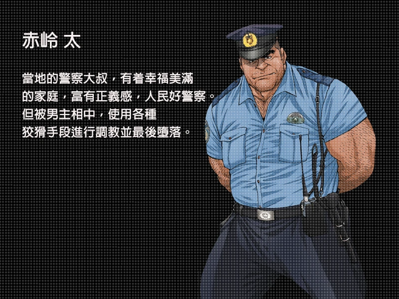
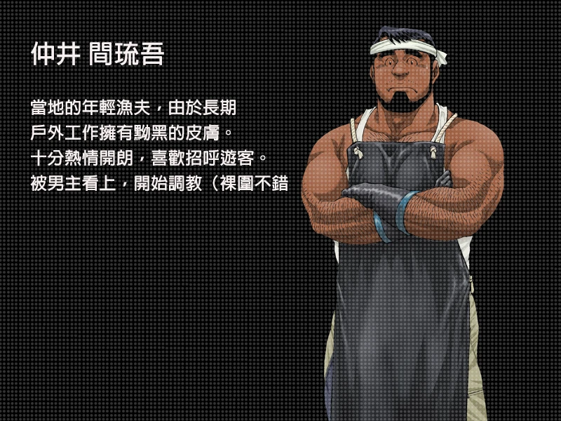
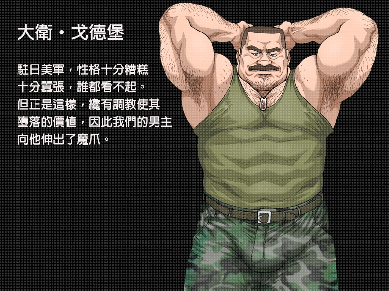
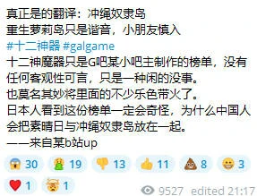
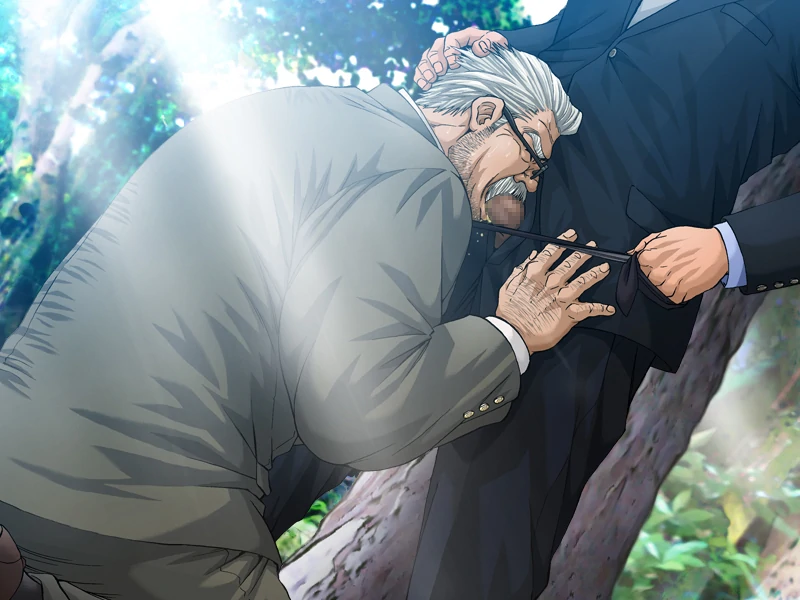
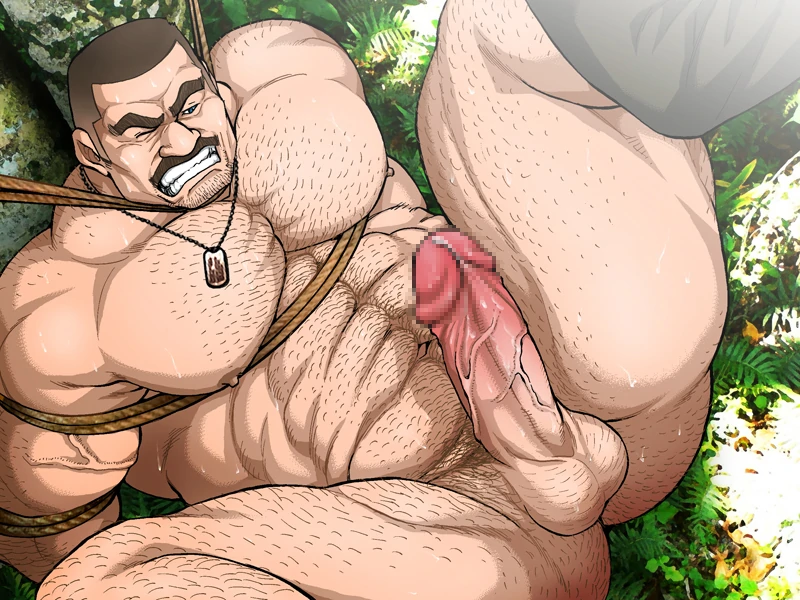
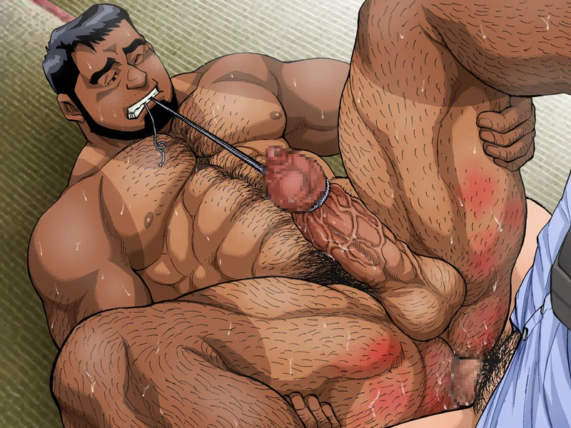

`作者: Patchouli Knowledge`

| 資訊一覽     |                  |
|:--------:|:---------------- |
| **開發商**  | Underground Campaign（該公司所有作品風格均一致） |
| **遊戲時長** | 10 - 15 H          |
| **類型**   | 後宮 拔作 gay 調教        |
| **難度**   | 較高                |
| **分級**   | R-18             |

## 故事梗概

久蓋島是沖繩的一個根本沒有開發的小小的離岸島，而你作爲房地產集團未來的主人，和祕書一起來到這對島嶼進行開發以賺大錢。
這座島沒有居民，完全保留了原始的模樣，而你表面上是要對其進行旅遊開發，事實上則是在島上對一個個健碩的猛男進行調教，讓他們在這天然的***牢獄***中成爲你的奴隸……

## 人物介紹

## 遊戲 OP

動畫來自被牆的油管，請翻牆

<iframe id='y2b' loading="lazy" src="https://www.youtube-nocookie.com/embed/kPusMSw1S8Y" title="YouTube video player" frameborder="0" allow="encrypted-media; picture-in-picture" allowfullscreen></iframe>

## 簡評

鑑於這是本站第六個“十二神器”的介紹，所以我先放一個關於“十二神器”的[科普](https://zh.moegirl.org.cn/index.php?title=Galgame%E5%90%A7%E5%8D%81%E4%BA%8C%E7%A5%9E%E5%99%A8)在這裏。不過能找到本站的人想必對這個稱呼應該不陌生吧。（這是筆者玩的最艱難的一部

  
優點：

  </img>

 * 其實就是不怎麼簡單的㚻向拔作，可能是十二神器口味最重的一部了，喜歡[熊](https://zh.m.wikipedia.org/zh-hans/%E7%86%8A%E6%97%8F)的快沖。
 * 淫樂做的意外的好，真的挺好聽的，可惜找不到ost資源，可能官方根本就沒做。

  
缺點：

  </img>

 * 十二神器中最爲欺詐的一部，不知多少萌新被欺騙過，尤其是漢化搞得那個封面。

| 評分        |      |
|:---------:|:----- |
| **人設**    | ♂/♂ |
| **立繪 & CG** | ♂/♂ |
| **劇情**    | ♂/♂ |
| **音樂**    | ♂/♂ |
| **綜合**    | ♂/♂ |

  ☢☢前方核能☢☢ 
  ☢☢前方核能☢☢ 
  ☢☢前方核能☢☢ 
  ☢☢前方核能☢☢ 
  ☢☢前方核能☢☢ 
  ☢☢前方核能☢☢ 
  ☢☢前方核能☢☢ 
  ☢☢前方核能☢☢ 

## CG鑑賞

## 遊戲資源

[🔗️盜版](https://t.me/RhineLibrary/138)

