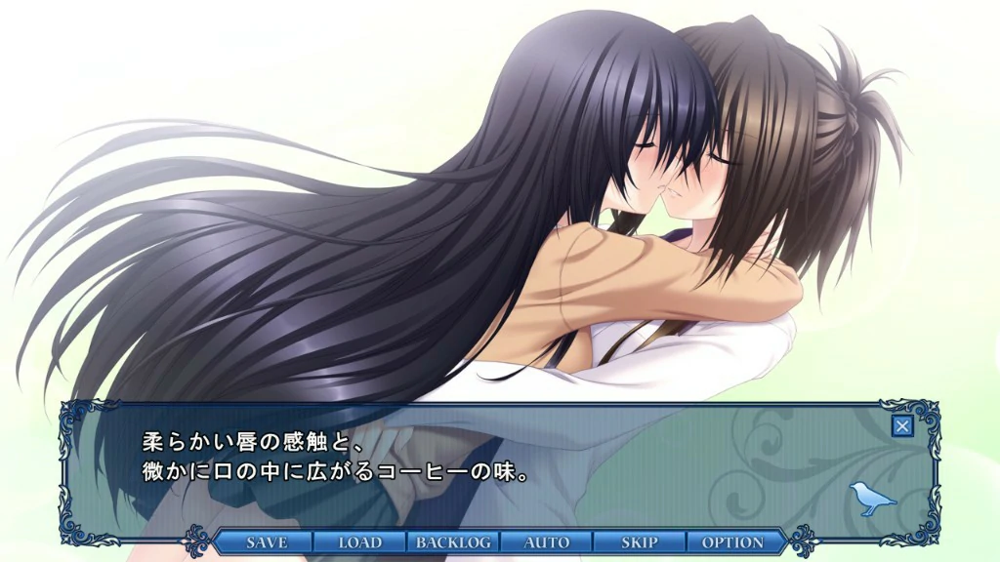
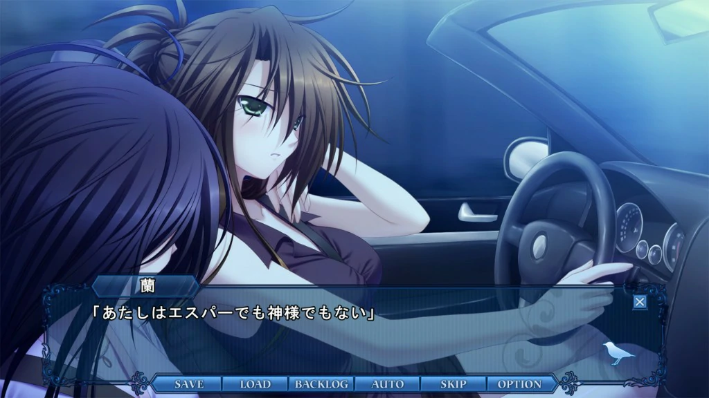

`作者: Patchouli Knowledge`

所以，再會了，知更鳥。
天上所有的鳥兒，
全都嘆息哭泣着，
當它們聽見了，
爲可憐的知更鳥響起的喪鐘。

| 資訊一覽     |                  |
|:--------:|:---------------- |
| **開發商**  | スマイル戦機 |
| **遊戲時長** | 6 - 8 H          |
| **類型**   | 百合 拔作 NTR 致鬱        |
| **難度**   | 無（全程無選項）                |
| **分級**   | R-18（無法接受NTR請迴避）             |

## 故事梗概

這部作品的一開始，就通過路人之間的對話和一則新聞將結局告訴了玩家：

  

    12日，在臺東區使用裁紙刀砍傷藥房店員的私立學院男生 因涉嫌殺人未遂被秋葉原警察局作爲現行犯逮捕。 
    其後，根據該少年的口供，從他家中發現了疑似已經死亡數日的少女的遺體。
  

就這樣，故事圍繞着無口少女 ***卯木 小鳥***、黃毛 ***雲雀丘 翔***、保健教師 ***河野 蘭*** 展開，
通過三人的視角進行敘述，小鳥和蘭相識相愛沉迷性愛互相慰藉，以及黃毛如何介入其中並殘酷的將兩人玩壞，最終到達開頭的結局，形成首尾呼應。

## 人物介紹

### 卯木 小鳥 （CV：一色 光）

經典的無口少女人設，看起來高冷，其實內心是個十分亞撒西的好孩子。

從小家庭缺愛，在老師的攻陷下很快就淪陷成爲P。

### 河野 蘭 （CV：飯田 空）

男女通吃的保健教師，身材姣好，在學生中人氣很高。

做事不計後果，大大咧咧的，算是T吧，把缺愛的小鳥拿捏死死的，但對她的愛是貨真價實的。

### 雲雀丘 翔

黃毛，人間之屑。

近乎變態的暗戀小鳥，爲了得到她不擇手段。

## 遊戲 OP

<video controls preload="metadata" width='100%' poster="../image/知更鳥/op.jpg">
  <source src="https://s3static-zone0.galgamer.eu.org/video-2d35/知更鸟/op+cn.mp4" type="video/mp4"/>
  
 To view this video please enable JavaScript

</video>

## 簡評

鑑於這是本站第五個“十二神器”的介紹，所以我先放一個關於「十二神器」的[🔗科普](https://zh.moegirl.org.cn/index.php?title=Galgame%E5%90%A7%E5%8D%81%E4%BA%8C%E7%A5%9E%E5%99%A8)在這裏。不過能找到本站的人想必對這個稱呼應該不陌生吧。（幹，你還真用來水了

  
優點：

  </img>

 * 百合，喜歡百合的絕對不能錯過，師生百合大做特做

  
缺點：

  </img>

 * NTR大作，只想當「長頸鹿」並且十分厭惡NTR的務必迴避
 * 人物智力令人堪憂，劇情推進有點強行

故事十分簡單甚至可以一句話概括，就是一個百合 + NTR的拔作，但這足矣對喜歡百合的玩家一個暴擊，尤其是在ACG圈子內。

由於百合作是絕對不可以有男人插足的（可以去百合吧搜索有關「雷」這一關鍵詞的帖子），該作就是給河豚當頭一棒，直接狠狠的蹂躪玩家百合獵殺，排除掉這些元素就是一個有些年頭，普通的拔作。

| 評分        |      |
|:---------:|:----- |
| **人設**    | 7/10 |
| **立繪 & CG** | 8/10 |
| **劇情**    | 7/10 |
| **音樂**    | 6/10 |
| **綜合**    | 7/10 |

## CG鑑賞

## 還在猶豫是否下載？

這裏有一個簡單試玩錄像

<video controls preload="metadata" width='100%' poster="../image/知更鳥/movie.webp">
  <source src="https://s3static-zone0.galgamer.eu.org/video-2d35/知更鸟/15min-know.mp4" type="video/mp4"/>
  
 To view this video please enable JavaScript

</video>

## 遊戲資源


（解壓密碼：莱茵）

