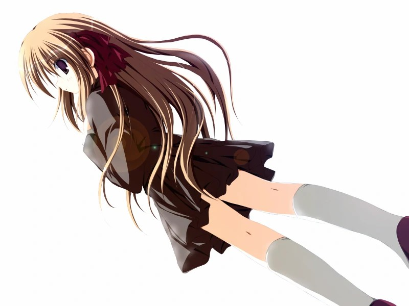
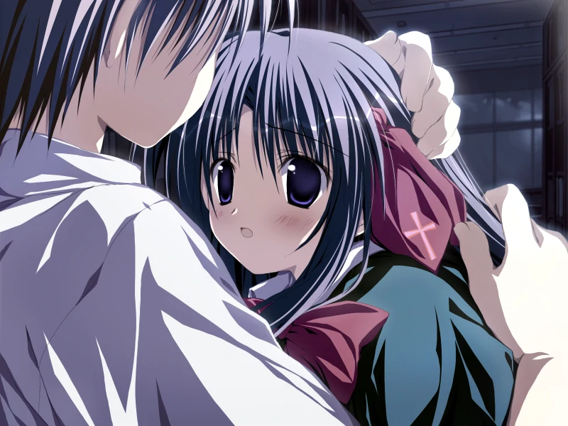
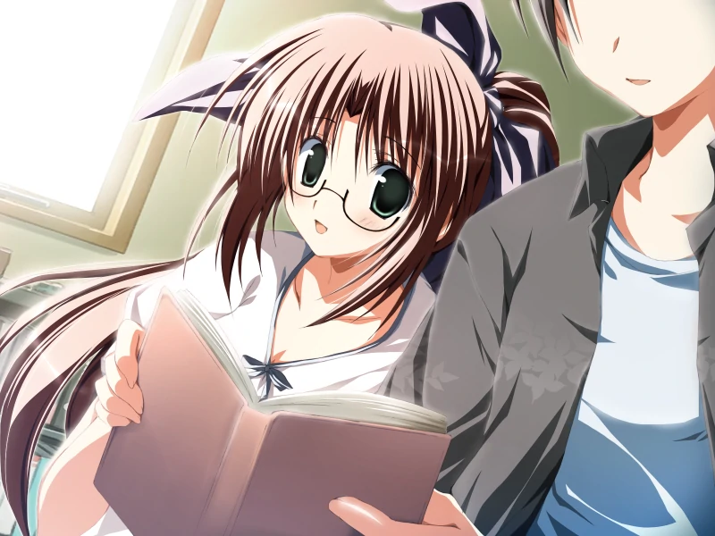

`作者: Patchouli Knowledge`

| 資訊一覽     |                  |
|:--------:|:---------------- |
| **開發商**  | PetitKeroQ(KeroQ的姊妹公司) |
| **遊戲時長** | 8 - 10 H          |
| **類型**   | 調教 拔作 妹妹 復仇        |
| **難度**   | 較高（指遊戲年代久遠win10天天閃退卡死，遊戲本身難度不高）                |
| **分級**   | R-18（注意不少調教場景，無法接受請迴避）             |

## 故事梗概

一顆週期彗星向地球飛來，專家們很快通過觀測等手段確定該隕石不會撞上地球只是和地球擦肩而過。
不用擔心末日降臨的人們鬆了一口氣，然而很快專家們又發現該彗星帶有很強的磁場，將會對地球磁場產生極大影響，相比於直接的撞擊，這個說法讓一般群衆摸不着頭腦，
「反正不會撞上地球，那應該無所謂吧」人們這麼想着去迎接這一天的到來……

但是就在彗星經過近地點那一刻，由於磁場的干擾，整個地球的電波消失了，人們所使用的無線通信一瞬間全部失效，這一天人稱***電波消逝之日***或者電視機消失之日。

而我們的男主***美作慎吾***也在這一天失去了他的父母和妹妹，正是因爲他們出差乘坐飛機因爲失去地面通信而墜機，男主則因爲發燒沒有隨行逃過一劫。

在家人的葬禮上年幼的男主聽到父親的同事談話得知，家人極有可能是被父親的上司***穗坂健一***害死的，從此復仇的種子便深深的埋在男主的心中，甚至成爲其活下去的動力。

時間推移，男主已經成長爲一個大帥b並上了高中，一次偶然他居然發現仇人的女兒***穗坂七海***是自己的學妹，爲了復仇，男主開始策劃接近七海，並開始了他的鬼畜調教計劃……

## 人物介紹



  

    

      

        

          {name}
        

        

          {yomi}
        

        

      

      

      
  
    

  
  



<sp-character no=0 name="若名 真尋" yomi="CV: 川島 莉乃" uid="ayase">
  

    男主的青梅竹馬，喜歡男主也是理所當然的。 
    每天都負責叫男主起床 
    Galgame的青梅竹馬都是人型鬧鐘嗎？
  

  

    簡單的眼鏡娘人設，再加上圖書委員的身份就更套路化了。 
    有一個姊姊（非孿生），以男主的說法她們倆長得一模一樣
  

  

    青梅竹馬是男主最後的良心所在，男主絕對不想讓她知道自己骯髒的內心。
  

</sp-character>
 

<sp-character no=1 name="仙川 流琉" yomi="CV: 野神 奈奈" uid="ayase">
  

    和男主一樣是十二年前電波消逝之日的受害者， 
    患有十分嚴重的電波恐懼症，拒絕使用一切電波有關產品， 
    所以當然是沒有手機的。
  

  

    是個十分敏銳的女孩，一開始就察覺到了男主可能要對七海圖謀不軌， 
    然並卵
  

  

    她和奈穗是青梅竹馬，從小到大一起生活，每天都在快樂地真人快打。 
  

</sp-character>
 

<sp-character no=2 name="奧山 奈穗" yomi="CV: 金田 真晝" uid="ayase">
  

    ⑨ 
    雙抗點滿的無鐵炮，整天被好友流琉蹂躪還活蹦亂跳， 
    十分樂天，即使被人叫大傻逼也就是笑笑。
  

  

    總能掏出電擊槍和震動棒這種奇怪的道具，讓人摸不着頭腦
  

</sp-character>
 

<sp-character no=3 name="穗坂 七海" yomi="CV: 本山 美奈" uid="ayase">
  

    十二年前其父親害死男主父母和妹妹，在葬禮上，七海的身影被深深烙刻在男主心中。  
  

  

    高中後被男主認出表示驚訝，並被男主計劃猥褻調教， 
    面對男主的調教從不反抗，叫啥就幹啥。
  

  

    本身有點天然呆，上該高中的原因也只是「校服很可愛」而已。 
    喜歡讀書，和真尋一樣也是圖書管理員。
  

</sp-character>
 

## 遊戲 OP

動畫來自被牆的油管，請翻牆

<iframe id='y2b' loading="lazy" src="https://www.youtube-nocookie.com/embed/XT6doQ0dNj8" title="YouTube video player" frameborder="0" allow="encrypted-media; picture-in-picture" allowfullscreen></iframe>

## 簡評

鑑於這是本站第四個“十二神器”的介紹，所以我先放一個關於“十二神器”的[科普](https://zh.moegirl.org.cn/index.php?title=Galgame%E5%90%A7%E5%8D%81%E4%BA%8C%E7%A5%9E%E5%99%A8)在這裏。不過能找到本站的人想必對這個稱呼應該不陌生吧。

編輯註：（幹，你還真用來水了

  
優點：

  </img>

 * 劇情的反轉還是挺有意思的
 * 純純的拔作，雖然畫風比較舊，但是搭配上各種刺激的調教內容還是有點風味（沒錯這句話就是從妹調搬過來的

  
缺點：

  </img>

 * 遊戲年代比較久遠，win10玩起來天天卡死無響應屬實折磨
 * 有小部分ntr和肢體殘害情節但可以迴避，敏感肌請迴避
 * 除了女主七海外其他女角基本工具人可有可無，但還是每個人都給了一條線有點迷惑

這部作品被稱爲妹調plus不是沒有道理的，故事也很簡單，就是復仇，對仇人的女兒進行各種慘絕人寰的調教（當然你也可以不調教推進劇情）。

整體流程較短，質量也說不上多好，勉強給個及格分吧。cg不錯，可以看看下面的cg預覽對不對胃口再選擇是否遊玩。
（標題寫着電波還以爲是電波作結果並不是讓我直呼***“rnm，退錢！”***）

| 評分        |      |
|:---------:|:----- |
| **人設**    | 7/10 |
| **立繪 & CG** | 8/10 |
| **劇情**    | 7.5/10 |
| **音樂**    | 5/10 |
| **綜合**    | 7/10 |

## CG鑑賞


../image/電波消逝之日/03.webp
../image/電波消逝之日/05.webp
../image/電波消逝之日/06.webp


## 遊戲資源


（解壓密碼：莱茵）

